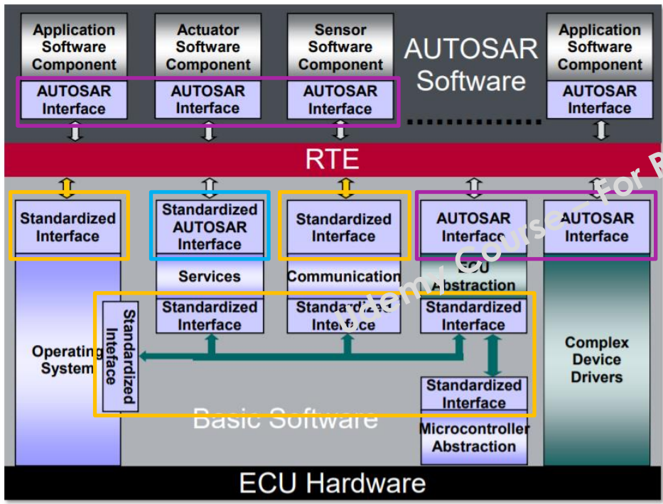

# AUTOSAR CLASSIC

<h1>
2. Base Software(BSW)
</h1>

<h2>
Base Software Overview(BSW)
</h2>
Layered Architecture
**ASW(Application Software):** 
Functional Modules(application software), that communicate with RTE

**RTE(Run Time Environment):** 
Middleware which realizes the communication between the software components and basic software.

**BSW(Base Software):**
Standardized software modules that are necessary for the funtioning of the higher software layers.

NOTE: After reaching today's goal, provide an explanation of all components in the layer below

- Microcontroller Abstraction Layer (MCAL): Controller Drivers, Memory Drivers, Com Drivers, IO Drivers. Lowest Software Layer in BSW. Acess direct microcontroller internal peripherals. Make higher software layers independent of microcontroller.
- ECU Abstraction Layer: On-board Device Abstraction, Memory Hardware Abstrction,Com hardware Abstraction, IO Hardware Abstraction. Offer APIs to access internal or external peripherals. Makes higher software layers independent(độc lập) of ECU Hardware. 
- Service Layer: OS Services, Memory Service, Com Service or Diagnostic services. Provide basic services to application and RTE layers.
- Complex Device Driver(CDD): Direct interaction-Hardware to RTE (tức là chảy thẳng tới RTE mà có thể không cần qua BSW). Used for high time constraint appications. Cases which are not specified by Autosar.

<h2>
 Autosar Interface 
</h2>

**Autosar Interfaces:**

Autosar standards categorize interfaces into three different categories 

- Autosar Interfaces:Autosar interface is a generic interface which is derived from (bắt nguồn từ hoặc được tạo ra từ) the configuations(sinh ra từ tool). Autosar interface are provided by the RTE and serve as an interface between appication software or between application software and the base software like hardware abstraction or complex device drivers (via RTE). For example, an application software might read input values and write output values via these interfaces. It can use to read or write APIS, which is derived from the configutions.

    + Summary: Derived Interface API's from input configurations like Ports etc., that are specified as per the Autosar standards
    + Used for conmunication between ASW's or Complex Device Drivers(CDD).

    Example: Rte_read*, Rte_Write*

- Standardized(chuẩn hóa) Autosar Interfaces: Interface that are specially predefined by Autosar standards as(dưới dạng) API's in C language. And it used as services between ASW and BSW modules like ECU State or Diagnostics Manager.

- Standardized Interfaces: Interfaces that are predefined by Autosar standards as API's in C language. Used between BSW modules or RTE/BSW/OS.
Example: "DIO_ReadChannel" API is defined by Autosar to read an IO pin by other BSW layers.

<h1>
3. Software Components
</h1>

<h2>
 Software Components
</h2>

Application software within Autosar is organized in self contanined units (được tổ chức bởi các đơn vị độc lập) called Atomic Software Component types.
Such Atomic Software components together form the complete functional implemantation of the software.

- Oke giờ nói tiếng Việt vì đoạn này khó hiểu thì cái Atomic Software Component là gì? Thì nó là 1 loại SWC và là đơn vị phần mềm nhỏ nhất của SWC. Tức là trong ASW sẽ có các SWC và trong các SWC sẽ có nhiều loại SWC để thực hiện 1 chức năng nào đó cho SWC lớn(hay gọi là Composite SWC). Thì trong các SWC này sẽ có đơn vị nhỏ nhất là Atomic SWC, nghĩa là các SWC khác muốn chạy tới RTE thì phải thông qua 1 hoặc nhiều Atomic SWC. Thì Atomic SWC sẽ chứa runable(hay các hàm), Port, logic xử lý để nhảy tới RTE.

Tiếp theo ta sẽ có các component types là các thuộc tính gán cho Atomic Software Component, tức muốn nói Atomic SWC này thuộc loại, kiểu mặc dù nó là đơn vị phần mềm nhỏ nhất thì nó vẫn cần phải biết nó là loại gì để đưa vào SWC phù hợp.

A software component can be categorized to atomic software component type, Parameter software component type and Composition software component type. (nếu dựa vào câu này ta có thể đoán là trong 1 SWC có 3 loại là Atomic, Parameter and Composition Software Component và cái Atomic kia sẽ được gắn 1 trong 7 thuộc tính mà mình nói bên dưới.)
- Nói qua về 2 cái SWC còn lại là Parameter SWC nó sẽ chứa tham số cấu hình (ví dụ: tham số PID, cấu hình cố định), không có runnable, không giao tiếp trực tiếp với RTE còn Atomic thì có. Tiếp đến Composition SWC nó sẽ gom nhiều SWC con bên trong(thường là Atomic hoặc Parameter) và nó cũm không làm việc trực tiếp với RTE.
-> Chỉ có Atomic sẽ làm việc trực tiếp với RTE.

**Software Components tasks one of the below types(Atomic):**

- AppilicationSWComponent: holds the functionality of the software. Example: Calculations, Functional/decision making Algotithms .. Vậy tức là gần như nó chưá tất cả các chức năng các hàm thông thường của 1 SWC.

- NVBlockSwComponent: is used whenever we have a requirement to sace critcal information in hardware memory that needs to be reused in future. This component type acts as a bright for the application software to access the NNM manager of the basic software.

- CDD component provides an easy access to hardware directly from application to fultill special timings and functional requirements.

- Service component is mainly used from the based software to provide services to the application layer. The service component takes few special rules that they can be part of the system composition and they are very bound to the ECU level. For example, if you pick up the base software module like the base software manager or the diagnostics event manager. They provide service to the application software and they can be moddelled as a service software component type.Ncl nó đơn giản là lấy cái dịch vụ (service) gửi lên swc thôi. 1 số sevice như Watchdog, Diagnostic,...và chú ý là cái ServiceSwComponent này là dùng cho ECU của chính nó.

- Service Proxy component is used if a particular service is to be used from a different ECU. Autosar Methodology says that an application component can be dynamically placed on diferent ECU's during system level configuration and in this case the access to the softwatr service might be from another ECU to access.

- ECU Abstraction component is a part of the software that access and interface between MCAL Layer and the application layer. Và nó có nói thêm là trong Microcontrol có nhiều cái External ngoại vi, thì mình có thể sử dụng ECU Abstraction component để truy cập. Và trong slide còn có ghi 1 cái rất quan trọng là EcuAbstraction component is a part of BSW (đây nhớ nó là 1 phần của BSW), which acts as an interface between MCAL and SensorActuator component on the ASW.(và đây nữa là cái SensorActuator là thuộc ASW nên tại sao ta thấy íi này với í bên dưới giống nhau nhưng thực chất là nó đang nói tới 2 component khác nhau, 1 cái ở BSW, 1 cái ở ASW, nhưng nó liên kết với nhau thoi)

- SensorActuator software component is used on the application layer to interact with the BSW ECUAbstraction layer, and acts as a interce to the other application compoents. Tức là nó sẽ lấy giữ liệu từ ECU Abstraction component và các SWC khác có thể lấy cái SensorActuator để tính toán. Và đấy là điểm khác nhau thoi

<h2>
 Software Components(Example)
</h2>

<h1>
4. Ports and Interfaces 
</h1>

<h2>
Autosar Port Interfaces
</h2>

Tóm lại ghi 1 đống bên dưới chả hiểu dell gì, xem lai sau.

Port: Autosar Architecture proposes(đề xuất) Ports as the mode of communication between Autosar modules.
- Provider Port(P-Port)
- Receiver Port(R-Port)
- ProviderReceiver Port(PR-Port)

Port Interfaces: The kind of information that are communicated between ports are defined by port interfaces. Oke t sẽ nói rõ hơn vì nghe nó hơi trừu tượng thì nó là 1 thành phần định cách SWCs giao tiếp với nhau, nó kiểu mô tả dữ liệu và cách truyền nhận dữ liệu giữa các SWCs. Và theo t đọc thì cái port interface định nghĩa các dịch vụ hoặc dữ liệu mà 1 SWC cung cấp hoặc yêu cầu thông qua ports. Thì nghe khó hiểu vc nên mình sẽ đưa ví dụ

Ex: 
- Thông tin thứ 1 giả sử có 1 interface tên  SpeedInterface (dạng Sender-Reciver, chứa 1 data element: VehicleSpeed kiểu uint16)
- Thông tin thứ 2 là sẽ có 2 Software Component(SWC): SensorComponent và DisplayComponent.
Thì Sensorcomponent có PPort tên SpeedSenderPort, gắn với SpeedInterface
DisplayComponent có RPort tên SpeedReceiverPort, cũng gắn với SpeedInterface.
-> SpeedInterface là định nghĩa trung gian nó cũm là 1 cái swc nhưng là nơi trung gian để các swc khác nhìn đến

Thì như t thấy ở ví dụ cơ bản thì sẽ có 2 SWC, 1 cái truyền 1 cái nhận và nó sẽ thông qua RTE để truyền nhận dữ liệu giữa các SWC, nhưng mà câu hỏi đặt ra Port thực chất là cái gì, các cái Interface nằm ở lớp nào? Thì t đọc thì mấy cái port hay port interface này chỉ là các cái config giống như trong tool stm32cube dell gì ấy cũm có mấy cái phần config cho port kiểu pullup, pull down chẳng hạn. Thì ở đây là cấu hình port hoặc port interface để t ra các hàm RTE 

**We have 6 type of interfaces that can be chosen based on the information that is communicated**

- Sender Receiver Interface: is used for communicating data between ports. Data can be any information in terms of primitive(nguyên thủy) or complex types.
Example: Variables of type interger, float, structure, ...
    - to send such data a component should have a provider port defined with a sender receiver port interface.

