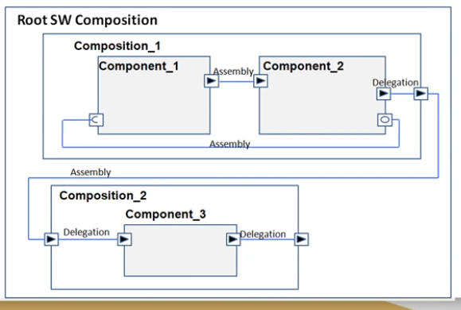
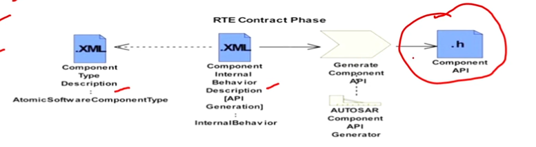

<h1>
4. RTE
</h1>

<h2>
4.1.RTE Entities - SWC, Composition, Ports
</h2>

Thì bài này nói về các loại SWC thì có 3 loại chính là Atomic, Parameter, Composition SWC:
- Nói về Parameter SWC là kiểu cung cấp các value chuẩn mà mình đã thiết lập từ đầu cho các SWC khác, và Paramater SWC sẽ không có khả năng thực hiện như viết hàm các thứ
- Nói về Composition SWC: thì nó sẽ chứa các SWC khác là các Atomic SWC đóa, thì việc nhóm này để gọi là cho nó trừu tượng, VD: Điều khiển quạt tản nhiệt chẳng hạn, cần tới 2 SWC (1 SensorActuator SWC để đọc dữ liệu từ sensor và 1 ECU Abstraction cho I/O của ECU -> gộp vào dễ quản lý).
- Nói về Atomic SWC thì nó sẽ là SWC thấp nhất và làm việc với RTE or layer dưới (nó sẽ chia thành 7 loại):
    - Application SWC: thì đây là 1 cái SWC bình thường thoi, làm những công việc ứng dụng.
    - SensorActuator SWC: Đây là SWC dùng để xử lý sensor và actuators.
    - Service Proxy SWC: Service ở đây giống như là server là người cung cấp hàm cho các client khác. Nhưng mà đối với Service Proxy nó sẽ không chưa service thật, nó giống như là người đứng ở ngã 3 và chỉ 2 hướng còn lại tới service thật. Nghĩa là sẽ có thể có nhiều ECU truy cập vào service proxy.
    - Service SWC: Còn đối với Service SWC này thì nó chính là Service thật, nó sẽ ở yên đợi client xin, hoặc service proxy sẽ lấy nó.
    - ECU Abstraction SWC: Thì nó sẽ làm việc trực tiếp với BSW modules, làm việc trực tiếp với I/O mà không thông qua RTE. Có mỗi cái SWC này làm được việc đóa thoi.
    - Complex Device Driver SWC: Thì làm việc với CDD thoii.
    - Nvblock SWC: SWC này để làm việc với bộ nhớ

Bài này còn nói qua về Port: sẽ có Provider Port và Receive Port (PPort và RPort) đơn giản đây là phương tiện giao tiếp giữa các SWC hay SWC với BSW ỵoi.

<h2>
4.2.Connector
</h2>

Thì cái định nghĩa conector này là nó được dùng khi mình dùng Composition SWC thoi thì sẽ có 2 loại connector
- Đầu tiên là Assembly Connector: Thì nó là kiểu connector giữa các SWC bên trong cùng 1 composition SWC. Và giữa 2 Composition cũm có thể dùng Assembly Connector có thể xem ảnh để hiểu cho rõ
- Còn Delegation Connector nó sẽ xuất hiện khi ta muốn giao tiếp giữa các SWC ở Composition khác nhau. Thì để giao tiếp được với nhau thì phải thông qua Composition. Và chúng ta kết nối SWC mà cta muốn giao tiếp tới Composition hiện tại bằng Delegation Connector (xem ảnh).

<h2>
4.3.Internal Beaviour-Runnables
</h2>

Thì cái này t thấy trong file arxml rồi
Thì cái này nói về cách hoạt động bên trong SWC cụ thể sẽ là 7 cái SWC trong Atomic SWC.

Trong cái này nó sẽ có Runable Entity, RTE event, Exclusive Areas

**Runnable Entity**

- Đầu tiên với Runable thì nó được coi như là 1 function thực hiện các chức năng, thì trong Runable có thể có nhiều Runable với các chức năng khác nhau hoặc được gọi ra 1 cách khác nhau như event (sẽ nói ở bên dưới), thì các runnable này được đặt tên hoặc đặt ở đâu hay sẽ được gắn cho event nào sẽ được config bởi AUTOSAR file arxml. Thì trong Autosar, mọi thứ đều được configuration based, vì vậy mọi thứ đều kiểu static. Thì theo đúng quy trình là các runnable phải được configure, các port cũm được configure, xong rồi sẽ được generated, và sẽ tạo ra các runnable file C và ta sẽ viết data vào trong đấy. Và trong quá trình run-time, mình dell thay đổi gì được vào autosar. Thì sẽ có 3 loại Runable:
    - Init Runnable: Là các runnable được định nghĩa là khi khởi tạo 1 cái ECU, nó sẽ được gọi đến để khởi tạo biến cấu trúc nội bộ .. và được gọi đúng 1 lần khi khởi động ECU, nên nhớ runnable là 1 cái hàm và cái init ở đây nó sẽ giống như là GPIO_Init đấy :)) thì mình vẫn phải viết ra. (InitEvent)
    - Periodic Runnable: Tức là cứ tới 1 thời điểm nào đó sẽ gọi Runnable đó 1 lần (Timing Event)
    - Server Runnable: thì runnable này chỉ chạy khi có kiểu service Client/Server thông qua port interface. (OperationInvokedEvent)

**RTE Events**

Thì các cái configured của runnable sẽ được kích hoạt bởi RTE events có 6 loại:

- Timing Event: thì đây là các sự kiện kiểu định sẵn thời gian, kiểu trong khoảng thời gian bao nhiêu chạy đến runnable đấy hoặc runnable đấy chạy được bao lâu.
- Operation Invoked Event: thì tức là 1 cái sự kiện của client và server, 1 cái client sẽ gọi cái server liên quan, thì nó sẽ sinh ra event ở server service.
- Mode Switch Event: tưc là trước khi mình thay đổi 1 cái mode gì đấy ở ECU, thì nó sẽ thực hiện 1 cái runnable nào đó trước khi switch. Giống như kiểu mình muốn switch shotdown mode của ECU, thì nó sẽ chạy tới 1 runnable lưu data hiện tại chẳng hạn rồi mới chuyển đổi.
- Data received event: tức là nó sẽ kích hoạt 1 cái runnable khi mà cái data, mà từ PPort gửi về done, thì nó sẽ kích hoạt runnable liên quan đến cái PPort và kích hoạt RPort thông qua runnble đó lấy cái data đấy.
- Data received Error Event: thì như cái tên :)) data nhận bị lỗi thì sinh ra Runnable.
- Data send completed Event: như cái tên tiếp thì khi gửi data hoàn thành tạo 1 cái runnable thông báo.

<h2>
4.4.RTE Overview
</h2>

Nói chung là nó giới thiệu về RTE thoi.

<h2>
4.5.Sender Receiver Interface
</h2>

Nói qua về Interface trước thì nó được config trong arxml, thường thì nó sẽ nói về sự liên kêt giữa các port. Các port có cùng interface sẽ liên kết với nhau, và port với interface sẽ cùng nhau gen ra các hàm C.

Thì có 6 Interface chính như sau:
- Sender Receiver Interface: là interface dùng cho truyền nhận data giữa các port, thì data ở đây thông thường là 1 cái biến thoi. Thì bên gửi sẽ gửi dât còn bên nhận làm gì thì không biết, nên nó sẽ có kiểu 1 cái data sẽ nhiều bên nhận.
- NV Data Interface: là interface dùng cho việc truyền nhận data từ flash (các data không bị biến mất lúc shutdown). Còn việc yêu cầu data từ flash như nào là do mình. Mình muốn cái SWC đấy chỉ đọc data hoặc chỉ gửi data, hoặc cả 2 thì do mình config.
- Mode Switch Interface: thì cái interface này dùng cho trạng thái hệ thông như RUNNING, STANDBY. Thì như ta đã nói về mode switch event nó sẽ kích hoạt khi trạng thái hệ thống thay đổi. Thì đây khi hệ thống thay đổi nó sẽ gửi data về Interface này và sẽ kích hoạt cái runnable sử dụng cái mode switch interface.
- Client Server Interface: thì Interface này là kiểu Client sẽ gọi 1 cái hàm giống như function call á, kiểu mình từ hàm main xong gọi đến hàm đó để chạy, ròi lại về hàm main để tiếp tục, kiểu kiểu vậy á. Thì cái client sẽ gọi 1 cái function từ service thoi.
- Parameter Interface: là Interface dùng cho việc trao đổi giữa runnable và data của hệ thống(được cofig sẵn ngay từ đầu chỉ đọc, không ghi).
- Trigger Interface: thì cái này giống kiểu có 1 cái lỗi gì đó của hệ thống thì nó sẽ tự trigger cái runnable này (diagnostic sẽ là nơi có thể sẽ kích hoạt cái runnable này) với lại m nhìn mấy cái event ấy, có mấy cái event error thì khả năng chính là sử dụng interface này.

Ở bài này còn nói về có 2 comunication là implicit và explicit.
Ngoài ra còn có Supports data distribution (Unqueued) và Event distribution (Queued).

<h2>
4.6.Queued vs non queued communication(thấy được sử dụng trong Sender-Receiver)
</h2>

Thì nó nói về cái quá trình truyền nhận của sender-receiver đấy.

Thì kiểu nó có thể có nhiều bên gửi sender và 1 bên nhận reiceiver, vậy phân bố các cái data được gửi đến đấy như nào.

**Queued communication**
- Thì giao tiếp theo trình tự thành nào gửi trước thì lấy trước theo đúng cơ chế FIFO (First in first out).

**Unqueued Communication**
- Thì nếu không queuce thì nó sẽ kiểu lấy dữ liệu của cái mới nhất, ví dụ có 2 sender 1,2 và cái sender 2 là cái mới gửi vào nhất. Thì nó sẽ nhận sender 2 và sender 1 sẽ bị mất dữ liệu.

<h2>
4.7.Implitcit vs Explicit Communication(thấy được sử dụng trong Sender-Receiver)
</h2>

Được rồi thì nước trước là phần này nó thường được nằm trong Sender-Receiver Interface
Đó thì nó sẽ nói về 2 cái Implicit và Explicit Receive
- Về Implicit tức nghĩa là nó sẽ cố định cái buffer cho 1 RPort, cố định port nhận với với port gửi. Và cái buffer đấy nó sẽ lấy cái giá trị từ port gửi trước và sau khi excecution (execution là quá trình runnable có RPort chạy). Và trong cái runnable của RPort mình không cần phải gọi ra cái hàm(hay runnable) của bên gửi mà chỉ cần lấy buffer, là có dữ liệu. Và việc cố định này nó sẽ chỉ tốt cho việc mình muốn giao tiếp 1-1 và các port khác sẽ không đụng vào.
- Về Explicit thì nó sẽ không có buffer cố định, tức là khi mà cái runnable của bên nhận nó chạy thì mình mới lấy dữ liệu của bên gửi trong cái runnable đấy. Và việc lấy dữ liệu là mình sẽ gọi hẳn hàm(hay runnable) của bên gửi, thay vì chỉ gọi buffer như Implicit. Thì việc này sẽ giúp bên nhận có thể có nhiều bên gửi, vì nó không bị config cứng giữa các port. Thì đương nhiên việc port nhận nào sẽ có những port gửi nào, vẫn phải được config trong file arxml ròi. Nhưng mà thay vì giao tiếp 1:1, thì giờ giao tiếp được nhiều thoi. Và khi bị config cứng như vậy t đoán kiểu bên nhận nó sẽ có 1 cái buffer riêng do Autosar cung cấp và khi gọi cái hàm nào thì cái buffer riêng đó sẽ lấy dữ liệu có cái hàm gửi đó và thực hiện thoi, chứ không phải như Implicit là chỉ được lấy 1 cái buffer của bên gửi thoi.

<h2>
4.8.Client-Server Interface
</h2>

Ở đây ta sẽ nói qua về Interface này, nó sẽ có 2 loại synchronous and asynchronous

- synchronous thì là gọi hàm bên server xong chờ cho nó xử lý xong mới quay lại client làm tiếp. Thì nó sẽ giống như trong C thông thường thoi.

- asynchronous thì gọi hàm xong cái, thì kệ đó nó chạy mình quay về làm tiếp ở phần client. Thì ví dụ hàm bên ấy có cái dữ liệu gì trả về thì lưu vào buffer của sender-receiver thì cứ có data biến là phải dùng sender-receiver rồi

Còn việc nó thực hiện như nào thì nói bên trên ròi client gọi và server sẽ thực hiện cái service(hay hàm) mà client yêu cầu (nó được config sẵn trong AUTOSAR arxml).

<h2>
4.9.Communication between SWC and BSW
</h2>

Hmmm thì cái này nó nói về giao tiếp giữa SWC và BSW thoi, thì nó sẽ use các cái Interface như Server, hay sender-rêciver interface như bthg, và phải thông qua RTE.

<h2>
4.10.Intra & Inter ECU Communication
</h2>

Ở đây sẽ giới thiệu 2 cái:
- Intra ECU Communication via RTE: tức là đây là giao tiếp giữa 2 hoặc nhiều cái SWC trong 1 ECU, nhớ đó 1 ECU thoi nên nó chỉ thông qua RTE là tới cac SWC.
- Còn Inter ECU Communication via RTE & BSW: đây là giao tiếp giữa 2 hoặc nhiều SWC mà khác ECU. Thì để giao tiếp được nó phải thông qua lớp RTE và đến các COM(hay các giao thức như CAN, LIN) dưới BSW để giao tiếp với ECU khác.

<h2>
4.11 RTE Generation
</h2>

Hmmmm thực ra bài này cũm được nó nói về cách các RTE đặt tên :v nhưng mà lười quáa lúc nào xem lại rồi ghi lại sau

Oke thì RTE Generaion sẽ có 2 giai đoạn chính: RTE Contract Phase và RTE generation Phase.

- Đầu tiên là giai đoạn RTE Contract: Thì đây là giai đoạn mà chúng ta sẽ gen ra các API hay các file header (.h) Thì để t ra file.h đương nhiên RTE sẽ phải dựa vào SWC này, dựa vào Port, dựa vào Interface của các SWC, và cách các SWC kết nối. Và từ đó sẽ Gen ra file.h. Vậy thì có những thông tin gì từ 1 SWC:
    - Component Type Description : mô tả loại SWC(ví dụ nó là application hay ECUAbstraction SWC)
    - Component Internal Behavior Description: mô tả các runnable, RTE events các kiểu đóa.
    - The actual source and/or object code: ý muốn nói mình muốn config cho tên các cái source hay cái object code như nào?
    - Component Implementation Description: Này là mô tổ các cái SWC thực hiện như nào, như là nối port này với port nào,...
    

    - Thì nhìn vào bức ảnh này ta thấy 2 file xml, 1 cái mô tả về SWC, 1 cái sẽ là của Interface(hay Internal Behavior), thì 2 cái file này nó giống như cái ví dụ demo ở bên khóa kia -> thì kết hợp 2 file này vào sẽ tạo ra file.h

- Tiếp theo đến giai đoạn RTE generation Phase thì nó sẽ chia là 2 section:
    - RTE Configuration Editing: Tức là cái section này sẽ tổng hợp các cái thông tin cần thiết từ quá trình ECU Configuration Description và từ đó config xuống dưới tầng BSW các thông tin cần thiết cho hệ thống như COM và OS. Và viện ECU Configuration Editor sẽ liên tục làm việc là tổng hợp các cái dữ liệu từ ECU Configuation Description đến khi mà việc config những thứ cần thiết cho BSW được hoàn tất hay được giải quyết. Khi các vấn đề config được giải quyết thì sẽ đến giai đoạn RTE Generator lúc này RTE thật sẽ compiled và linked các phần ở BSW với SWC.
    - RTE Generation Phase: thì giai đoạn này là lúc mình tạo ra các luông RTE thật sự là file.c

-> Thì theo chat GPT cũm như theo như t ghi thì các giai đoạn tổng hợp sẽ như sau thì RTE Constract sẽ xác định các cấu trúc SWC, port, runnable, ... tức là chỉ nói tới các thông tin và tạo ra các VFB sinh ra file.h, tiếp theo sẽ đến RTE Configuration Editer sẽ là config các tầng bên dưới, như init(), hoặc là nó sẽ kết nối SWC vào các ECU hay mapping port,.. Còn RTE Generation nó sẽ tạo ra các file.c tạo ra cái luồng dữ liệu thật sự. Mặc dù nói các giai đoạn tạo ra file.h, file.c nhưng trên thực tế đến lúc hết 3 cái giai đoạn kia nó mới tạo ra các file.h, file.c thực sự, các giai đoạn chỉ là ngầm định thoi. Coi như cái RTE Generation Phase chính là giai đoạn tổng hợp tất cả các thông tin phía trên để tạo ra các file thật sự. Đây thì hình ảnh bên dưới cũm chỉ rõ sự ngầm định đóa, bằng việc chỉ RTE Contract Phase là Application Header(.h)

Thì vừa này là quá trình còn bây h ta sẽ nói về các file.c, file.h được tạo ra có những file nào và chức năng

- Rte.c: thì file này sẽ tạo ra các biến(instance) của những struct được sử dụng cho mỗi SWC mà RTE tạo ra và ngoài ra còn các API hay hàm gọi ra các SWC được khai báo trong đó. (thực ra cái này muốn rõ hơn thì xem lại video)
- Rte_Type.h: thì nó là kiểu dữ liệu trong AUTOSAR mà mình định nghĩa lại.
- RTE Application Header File: thì file này sinh ra là header file của 1 Atomic SWC, và khi nào dùng đến SWC tương ứng mình gọi file.h tương ứng để lấy các biến các hàm liên quan 'RTE_<SW-Component name>.h'
- Rte_Hook.h: đây là header của VFB Trace, thì cái VFB Trace nó sẽ theo dõi quá trình truyền nhận, trao đổi thông tin giữa các SWC, hoặc những SWC qua tầng RTE, file này được tạo ra khi mình enabled VFB Trace.
- Rte_Cbk.h: cái này nó sẽ chứa các hàm callback, tức là các hàm kiểu như ngắt ấy, kiểu trong nhiều trường hợp, BSW layer,hoặc RTE không trực tiếp điều khiển các hành vi mà cần phả gọi 1 hàm nào đó như kiểu có tín hiệu CAN đến, thì RTE hay BSW sao biết luoon được và cái RTE Application cũm không biết trước, thì cần những file.h này để biết.

