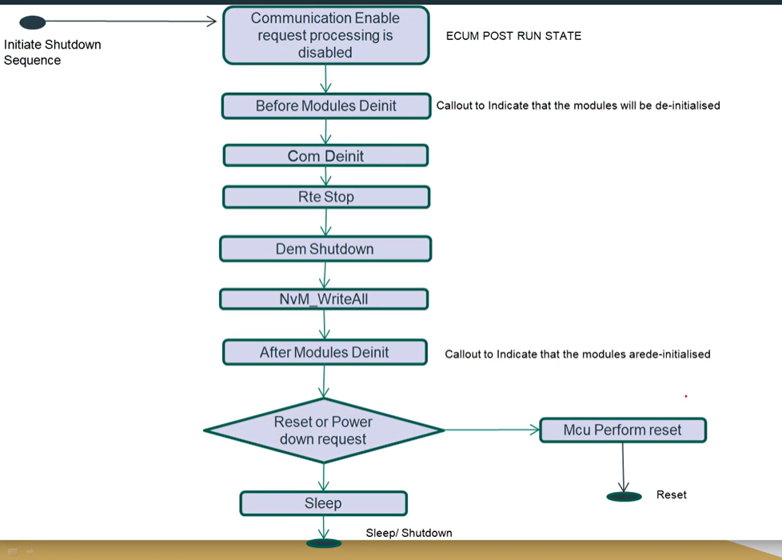
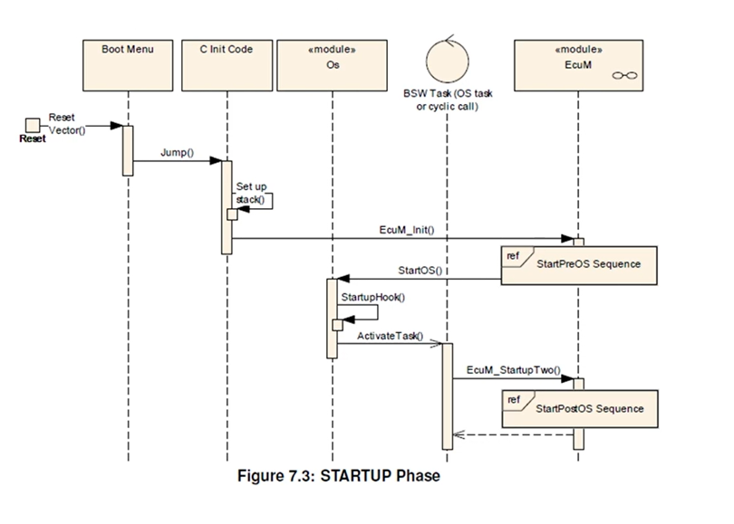
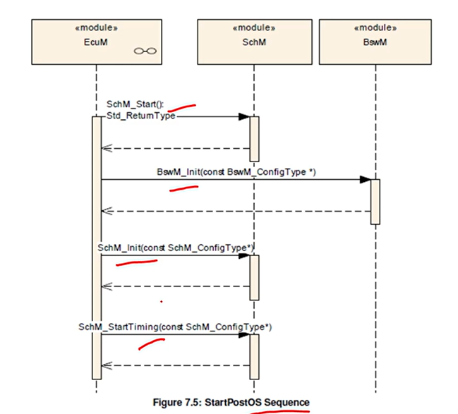
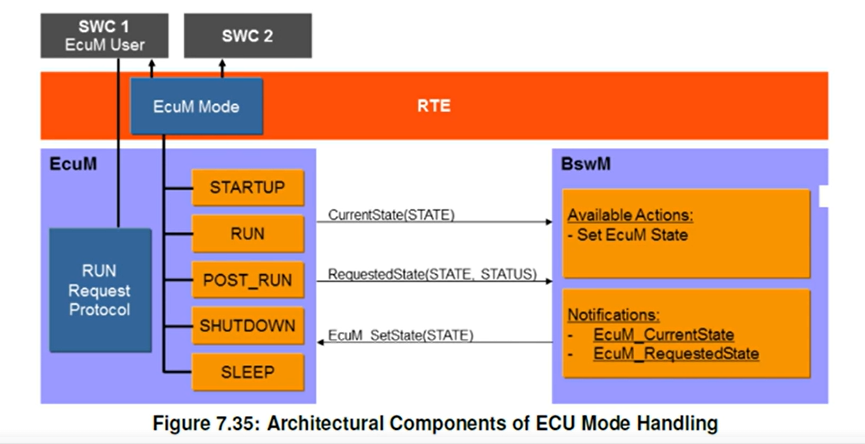

<h1>
5. Startup and Shutdown Sequence
</h1>

<h2>
5.1. Startup Sequence
</h2>

Oke nói về quá trình start up thoii, cơ bản cũm dễ hiểu nhiều step, nên xem nhiều để nhớ thoi. Thì t sẽ nói ngắn gọn như trong video luôn.

Đầu tiên bật nguồn đúng không thì nó sẽ phân bổ bộ nhớ các thứ thì tiếp theo nó sẽ vào cái bootloader chính của hệ thống để nhảy vào Boot Manager và để check xem hệ thống có gì hay chưa, nếu có thì nhảy tới application main và check 1 cái application và check tiếp xem nó có bắt lập trình lại không và nếu không thì mình qua Bootloader thoi. Tiếp theo ta sẽ nói về trong cái main function của Autosar thì có EcuM (cái này sẽ có hẳn mấy bài bên dưới), và EcuM sẽ được gọi và nó bắt đầu init Cdd và 1 số BSW modules. Và sau đó OS sẽ chạy và bắt đầu tự động chạy các task. Bằng việc vào cái Schm init function (Schm_init()) để chạy định kỳ các task BSW, kiểu nên kích hoạt BSW module nào trước nào sau đóa và khởi tạo BswM. Tiếp đến NvM_ReadAll được init trong vòng lặp do-while (này là gửi dữ liệu từ flash lên RAM). Và các modules mà dựa vào việc NvM_ReadALl hoàn thành như Dem(Diagnostic event manager) được khai báo. Sau đó SWCs sẽ được khai béo trước gọi là quá trình thực thi application. Tiếp đến WdgM(Watchdog Manager) sẽ được khai báo và RTE sẽ được chạy bằng việc bắt đầu API.

Và dưới đây ta sẽ nhìn tổng quan về qus trình startup và có nhiều câu hỏi như BswM_Init, ECuM Init là cái gì và nó nằm ở đâu, thì mình sẽ giải đáp sau.

**Kết luận**

Thì việc startup sequence cho 1 ECU sẽ được xử lý bởi ECU Manager module or EcuM. Thì EcuM nó sẽ chịu trách nhiệm cho viẹc init cái gì cũm như không định nghĩa gì cho toàn bộ ECU. Và trong việc thực hiện 1 ECU sẽ có 3 layer chính là BSW manager, Autosar OS, and the Scheduler Manager(SchM). Do đó thì EcuM cũm sẽ chịu trách nhiệm init cũm như deinit cho cả 3 layer kia luôn, cũm như 1 số module BSW cơ bản. Thêm nữa EcuM cũm chịu trách nhiệm cho việc xử lý các trạng thái của ECU như SLEEP hay SHUTDOWN state

-> Tức là EcuM sẽ quản lý vòng đời của 1 ECU và cách khởi tạo, tức là nó sẽ là người hướng dẫn cho ECU đó.

<h2>
5.2. Shutdown Sequence
</h2>

Thì đầu tiên sẽ có 1 communication bật lên để yêu cầu các quá trình phải disable và sau đó trình ECU Manager sẽ chuyển đổi trạng thái ECU sang POST RUN. Và 1 cái BswMCallouts được thiết lập để lưu các thông tin application của BSW modules trước và sau khi hủy khởi tạo (deinit). Tiếp theo là sẽ lưu hết các thông tin về Flash bằng việc sử dụng NvM_WriteAll trong 1 vòng lặp do-while. Sau đó phụ thuộc vào cái shutdown target, the sleep và the MCU perform reset API sẽ được gọi.

Lưu ý là nếu trong quá trình shutdown phase mà có 1 sự kiện wakeup, thì ECU Manager module sẽ hoàn thành việc shutdown và restart ngay lập tức

Ảnh dưới đây để thấy rõ các bước shutdown sequence.

<h1>
6. ECUM Modules
</h1>

Thì ở phần này mình sẽ giải quyết tương đối về các cái khó hiểu từ phần trước, và có những cái thuật nghĩ ở phần trước tiếng Anh mình nói bằng tiếng Việt nên đọc lại phần trước chỉ là để tham khảo qua sequence, còn từ phần này sẽ hiểu sâu về việc sequence thực hiện như nào,

<h2>
6.1 ECUM Introduction and Fixed ECUM
</h2>

Thì nói qua về ECU Manager thì đây là 1 module quan trong trọng việc quản lý vongf đời ECU. Thì nó sẽ có chức năng cơ bản sau:
- Init và deinit OS, SchM (Scheduler Manager) và BswM cũng như 1 số các module BSW.
- Config ECU ở chế độ SLEEP hay SHUTDOWN.
- Quản lý tất cả các sự kiện wakeup trên ECU.
- ECU Manager module cung cấp cái protocol để phân biệt hay kiểm định được đou là sự kiện real wakeup và đou là eratic(giả) event.

Nói thêm về wakeup event thì nói về cái này khá nhiều nãy h là nó là tín hiệu đánh thức ECU từ chế độ Sleep/Low-power trở lại trạng thái hoạt động(Run). Việc Wakeup này có thể đến từ CAN bus nhận dữ liệu, nút nhấn, timer, cảm biến, tín hiệu điện áp ngoài. Còn việc Wakeup Event giả(erratic) là kiểu nhiễu xảy ra làm tác động đến các chân wakeup đó.

**Sự khác nhau giữa Fixed EcuM and Flexible EcuM**
- Đầu tiên như cái tên thì Fixed EcuM là nó sẽ fixed cứng quá trình chạy của ECU kiểu Startup -> RUN -> Sleep. Và Fixed EcuM chỉ có 3 states chính thoi là OFF, RUN, SLEEP và sự chuyển đổi giữa các trạng thái này là STARTUP và SHUTDOWN. Thì với việc là nó cố định như này thì fixed EcuM chỉ phù hợp với những ECU không yêu cầu đặc biệt như startup 1 phần hoặc startup nhanh. Và Fixed ECUM không hỗ trợ cho ECUs có multi-core.
- Về flexiable EcuM thì mạnh mẽ hơn và tập hợp trạng thái cố định và chuyển đổi giữa chúng để cho phép các tình huống sau:
    - Partial startup or fast startup(thì cái đấy là nó sẽ khởi động 1 phần của hệ thống những cái cần thiết, còn fast thì khởi động toàn bộ nhưng với tốc độ nhanh)
    -Có nhiều trạng thái (operational state) và có nhiều core trên 1 ECU nên mỗi nới có thể có trạng thái khác nhau như STARTUP, SHUTDOWN

Giờ hình ảnh này sẽ nói rõ hơn về các States trong Fixed ECUM:

Nói qua về các trạng thái khá quan trọng:
- Startup state: nó sẽ chia trạng thái thành 2 phần, 1 là trước khi OS được init và sau khi OS được init. Mục đích của Startup là khởi tạo BSW modules.
- RUN State: Sau khi tất cả các module của BSW gồm OS và RTE được init, thì EcuM sẽ vào trạng thái RUN state. Nó se chỉ định các SWCs trong Application layer là sẽ liên quan tới các RTE and BSW đã được init. Và bây h nó có thể bắt đầu chạy các chức năng.
- Shutdown State: Nó sẽ xử lý và kiểm soát quá trình shutdown của BSW modules. Và kết quả là sẽ đưa ra 3 cái target cho ECU là SLEEP, OFF, or Reset. (thì 3 cái trạng thái này như cái tên của nó nên không làm).
- Wakeup State: Là sự kiện xảy ra khi ta bị đánh thức khi đang ở trạng thái SLEEP. Thì ở trạng thái này nó sẽ kiểm tra xem sự kiện đánh thức kia là đúng hay giả vờ, vì thi thoảng sẽ có các điều kiện lỗi làm đánh thức hệ thống.

<h2>
6.2 Flexible EcuM states 
</h2>

Thì nhìn vào cái này nó khá rối :v nhưng về cơ bản trước thì nó sẽ có 4 phần chính là STARTUP, UP, SHUTDOWN, SLEEP (trong các phần này sẽ có nhiều phần nhỏ khác ta sẽ phân tích sau).

- Startup Phase: thì nhìn nó khá giống với cái fixed sẽ có 2 phần trước và sau OS init. Mục đích chính của START phase là init các cái BSW khác nhau.
- UP Phase: Thì vào giai đoạn này sẽ là giai đoạn bắt đầu chạy OS và hoàn thành quá trình init SchM và BswM.
- Shutdown Phase: thì quá trình này đơn giản là quản lý quá trình shutdown các BSW modules thoi, và sẽ chọn 2 target state OFF or Reset thay vì 3 như fixed EcuM.

<h2>
6.3 Start up phase 
</h2>

Thì cái hình ảnh trên nói về giai đoạn startup kĩ hơn, kiểu trước và sau OS init chuyện gì xảy ra. Được rồi giờ ta sẽ nói sẽ từng phần

- Activities prior to EcuM_init: đây nói về hành động trước khi vào EcuM_init, dựa vào hình để biết rõ hơn. Thì khi ECU được bật thì MCU sẽ init, đầu tiên nó sẽ nhảy tới vector table để mà chạy quá trình bootloader code. Kiểu trong quá trình bootloader mình biết là quá trình đẩy code vào hệ thống như kiểu khởi tạo bảng vector table(trong đó có khởi tạo vùng stack), đẩy dữ liệu từ memory lên RAM, init những BSW modules cơ bản (kiểu các module nó không liên kết với nhau hoặc không liên quan đến OS là các module cơ bản), thì việc init này sẽ được thực hiện bởi code C. Đó thì ngoài ra nó còn khởi tạo các C variables. Và sau đó sẽ call tới EcuM_Init() đây là 1 hàm hay 1 API để gọi tới ECU State Manager và nó sẽ bắt đầu tiến hành quá trình tiếp theo của startup.
- Activities in StartPreOs sequence: Ở giai đoạn này về cơ bản ta sẽ khởi tạo toàn bộ BSW module để bắt đầu OS. Thì quá trình việc nó khởi tạo OS như nào thì sẽ có hẳn 1 cái bảng các hành động trong cái StartPreOs sequence này rùi nó mới gọi tới StartOS(). Thì dưới đây là bảng và ta sẽ nói qua về từng cái

Thì theo lần lượt cái init đầu nó sẽ khởi tạo các cái interrupt priority (giống cái bảng vector table). Tiếp theo init block 0 này nó sẽ gọi các driver init và các cái low level code. Tiếp theo ở quá trình này sẽ thực hiện post-build . Và các bước tiếp theo nó sẽ kiểm tra và hoàn thành các cái modules còn lại. Và cuối cùng sẽ start OS. Bảng bên dưới sẽ đưa ta cái nhìn khái quát về quá trình trong StartPreOS Sequence.

- Tiếp đến StartPostOS Sequence: Thì nó sẽ dựa vào bảng dưới đây chủ yếu nó sẽ khai báo các Scheduler của hệ thống thoi

<h2>
6.4 Shutdown phase 
</h2>

Thoi phần này xem video chứ dell biết ghi gì.

Về cơ bản là nó sẽ nói về tắt lần lượt cái gì kiểu tắt OS, tắt hook, deinit BSWM, deinit SchM, xong xem có target shutdown không hay có wakeup không. Ncl xem video thì sẽ rõ hơn. Nhưng cơ bản nó cũm chỉ lần lượt như vậy

<h2>
6.5 Shutdown Target 
</h2>

Hmmmm phần này chỉ xem thoi, chả có gì đáng để ghi cả 

<h2>
6.6 UP Phase 
</h2>

Thì ở cái UP Phase này thì EcuM_MainFunction sẽ được thực thi và có 3 chức năng chính.
- Đầu tiên kiểm tra xem wakeup sources(gồm NONE State, PENDING State, VALIDATED State, EXPRIED State) được woke up chưa .
- Tiếp đến sẽ kiểm tra Alarm Clock Timer
- Và nó kiểu nằm giữa để phân đoạn RUN và POST_RUN
-> Thì cái giai đoạn UP Phase này chỉ yếu sinh ra sẽ là nơi mà wakeup nó sẽ chạy vào đầu tiên khi nó tỉnh lại. Ví cái UP Phase là nằm ở giai đoạn thiết lập xong hết mọi thứ ròi, chỉ việc chạy thoi.

Ở bài còn nói về sơ đồ của Wakeup Source nên có thể xem lại để hiểu hơn, chứ không biết ghi gì.

<h2>
6.7 Sleep Phase 
</h2>

NCL cái phần nàu cũm chỉ nên xem video để nó nói về giai đoạn sleep như nào

<h2>
6.8 Mode Handling 
</h2>

Đây là hình ảnh sẽ cho thấy EcuM sẽ nằm ở đâu trong hệ thống.
Và như ta biết EcuMFlex sẽ phân phối những request và releases được tạo bởi SWCs tới BswM. Sự kết hợp giữa EcuM và BswM là điều bắt buộc vì BswM là người quyết định các trạng thái khác nhau có thể được tạo ra và EcuM chỉ là người nhờ vào BswM để hiện thị các trạng thái đó lên. Uuuu vậy là dựa vào bà trong udemy nói là thật thì BswM sẽ là người cung cấp State. Còn mấy cái Current hay Request State giống như là gửi thông báo chứ không tác động vào trạng thái của State. Kiểu nhiều lúc bên SWC nó cũm muốn yêu cầu State kiểu vậy, kiểu t muốn tắt, m cho t tắt đi :v. Phân biệt giữa release và request ví dụ yêu cầu 1 cái State thì sẽ gọi là released, còn nếu mà mình đã nhận được cái yêu cầu đó thì mình sẽ gửi lại 1 thông báo thì đó là request.

Oke giờ nói về các State:
- STARTUP: khai báo init thoi thì nó sẽ được set bởi RTE whi mà RTE_Start() được call thoi.
- RUN: khi mà các BSW cần thiết được thiết lập thì BswM sẽ chuyển quan chế độ này.
- POST_RUN(là giai đoạn mà chương trình sắp bước vào SHUTDOWN, ở đây sẽ thực hiện 1 số chương trình trước khi tắt): EcuM yêu cầu POST_RUN khi mà việc thực hiện RUN không khả dụng nữa.
- SLEEP: EcuM request SLEEP Mode khi mà việc RUN hay POST_RUN không khả dụng nữa và shutdown chọn target là Sleep
- SHUTDOWN: tương tự như SLEEP nhưng target được chọn ở đây là SHUTDOWN 

Giờ thì cái ECUM cũm sẽ liên quan tới việc Bootloader, cung cấp cho bootloader 2 hàm để Bootloader chọn boot target

Các lỗi sẽ có thể xảy ra trong quá trình startup và shutdown:
- Vấn đề về lỗi config liên quan đến EcuM
- BSWM sẽ chịu trách nhiệm về báo lỗi của nó
- Ngoài ra còn các lỗi Hook như Ram check trong lucs wakeup bị lỗi, postbuild config data bị lỗi, lỗi code-> còn mã lỗi như nào lên video mà xem :v. Ngoài ra tiếp còn các lỗi development cũm là lên video xem chứ nhớ sao hết lỗi.

