Khóa học này mình sẽ kết hợp với khóa học trước để hiểu sâu các vấn đề, và thường sẽ là phân tích lời giảng của người ta.

<h1><summary>3. AUTOSAR Basics</summary></h1>
<details>
<h2><summary>3.1.AUTOSAR Introduction</summary></h2>
<details>
- Nói chung là phần này giới thiệu vớ vẩn thoi, đọc bài của anh Nghĩa là đủ

The classic Autosar platform runs on a microcontroler and is divided into 3 main layers:
- Basuc Software (BSW)
- AUTOSAR Runtime Evironment(RTE)
- Appication Layer

Need for Autosar?
Bởi vì là nếu như ngày trước mà không có Autosar thì phần cứng và phần mềm nó sẽ liên kết chặt chẽ với nhau, thay phần cứng cái thì phần mềm cũm sẽ phải viết lại từ đầu. Nên vì thế người ta cần Autosar để độc lập giữa các lớp Hardware và Software.

So the main motto of Autosar is to cooperate on standards and compete on implementation(cạnh tranh về việc thực hiện). Nói vậy nghĩa là sao? Cooperate on standards tức là các công ty OEM cùng nhau ngồi lại để tạo ra chuẩn Autosar để các nhà cung cấp có thể dễ dàng hợp tác với nhiều công ty chẳng hạn. Còn compete tức là cạnh tranh để thực hiện nó ra sao, tức là 1 số công ty có những con chip mạnh hơn để xử lý cảm biến hoặc 1 số cty ô tô sẽ nhiều tính năng tiện ích như cửa sổ trời các thứ, thì đó chính là do các hãng người ta phát triển.

For the benefit for each department:

- OEM: Same software can be reused for different variants of cars (có thể tái sử dụng cùng 1 phần mềm cho nhiều loại xe khác nhau). And they main ability to compete on innovative functions and the flexibility is also increased (và khả năng cạnh tranh chính của họ về các chức năng sáng tạo và tính linh hoạt cũm được tăng lên). And also the software developemnt cost is also reduced
- Supplier: The efficiency would be improved. New business models are possible. Development partitioning among suppiers.
Nguyễn Hữu Nghĩa say:
Thì các Layer trên cũm được phân hóa về mặt phần mềm để cho các công ty / nhà sản xuất khác nhau có thể dễ dàng tham gia vào quá trình phát triển phần mềm xe. Nên nó sẽ tạo ra 1 số các thuật ngữ cơ bản về các nhà cung cấp phần cứng/phần mềm:
- OEM - Original Eqipment Manufacturer
- Tier 1:
- Tier 2:
Đọc kĩ hơn ở link: https://www.laptrinhdientu.com/2023/01/Autosar01.html
</details>

<h2><summary>3.2.AUTOSAR Layered Architecture</summary></h2>
<details>

- Application layer: So your application code, it sits in this application layer.
- Runtime evirionment is like a virtual function bus, which makes your application independent of the below layer this part is called BSW that basic software.
- BSW: consists of service layer,ECU absraction layers and lowest is your microcontroller and above microcontroller we have MCAL. And this is BSW complete.
    - The MCAL is the lowest software layer of the Basic Software. It contains internal drivers, which are software modules with direct access to microcontroller and internal peripherals.
    - The ECU Abstraction Layer interfaces(tương tác) the drivers of the Microcontroller Abstraction Layer (tức là nó sẽ lấy cái trừu tượng của lớp MCAL). It also contains drivers for external devices. It offers an API for access to periperal and devices regardless of (bất kể) their location (microcontrol internal or external) and their connection to the microcontroller (port pins, type of interface) (có nghĩa là nó không phụ thuộc vào vị trí của internal or external peripheral or connection to microcontroller, kiểu mình không cần quan tâm tới cái địa chỉ mà mình trỏ tới mà chỉ cần thông qua API như DIO_Write chẳng hạn, í nó là vậy).
    - CDD The Complex Drivers, CDD Layers spans(trải dài) from the hardware to RTE(tức là nó sẽ không liên quan gì đến các lớp trong BSW và nó chạy thẳng đến RTE luôn). They provide the possibility to integrate specical purpose functionality, eg. drivers for devices:
        - which are not specified within AUTOSAR.
        - with very high timing constrains
        - for migration purposes etc 
        - might be application, microcontroller, and ECU hardware dependent
    - The Service Layer is the highest layer og the Basic Software which aloso applies for its relevance for the application software: while access I/O signals is covered by ECU Abstraction Layer, the Service Layer offers:
        - Operating system functionality
        - Vehicle network comunication and management services. (Com module)
        - Memory services (NVRAM management)
        - Diagnostic Services (include UDS Comumunication, error memory and fault treatment)
        - ECU state management, mode management.
        - Logical and temporal program flow monitoring(watchdog manager) (Giám sát luồng chương trình logic và thời gian)
    -> So this is like the brains because your OS is there and your complete management of your network communication, all those is this layer. So basically it provides basic services for the appilcation, RTE and basic software modules.

- RTE is a layer providing communication services to application software. It is an interface between your application and your BSW, and it make your application independent with BSW, or you can sau underlying layers. It acts as a virtual function bus. So above the software of your application, it is component. So we the term software components. So each application is written in components called as software components and the Autosar software component can communicate with other components. So within our ECU it can communicate or within our different ECUs also then con communicate and makes the software component independent from the mapping to a specific ECU. (Í muốn nói là SWC sẽ được thiết kế sao cho không phụ thuộc vào việc nó mapping hay chạy trên bất cứ ECU nào là nhờ cái RTE đóa).

- The Basic Software can be subdivided into the following types of services:
    - Input/Output (I/O): Standardized access to sensors , actuators and ECU board peripherals.
    - Memory: Standardized access to interal/external memory (non volatile memory - NVM là bộ nhớ không mất dữ liệu khi tắt nguồn). 
    - Crypto: Standardized(chuẩn hóa) access to cryptographic primitives(mã hóa) including internal/external hardware accelerators (này í muốn nói là ECU có chip hộ trợ mã hóa như phần cứng AES, Crypto module có thể dùng phần đó để chạy nhanh hơn). We need it for security purposes.
    - Communication: Standardized access to vehicle network systems, ECU onboard communication systems and ECU internal SW
    - Off-board Communication: Standardized access to: Vehicle-to-X communication, in vehicle wireless network systems, ECU off-board communication systems
    - System: Provision of standarddizeable (OS, timers, error memory) and ECU specific (ECU state management, watchdog manager) services and library functions 

</details>

<h2><summary>3.3. Configuration Classes and Interfaces in Autosar</summary></h2>
<details>

The first one is pre compile time and this we have proprocessor instructions. Code generation based on this preprocessor instructions is done.

**Pre compile time**

Uses cases:
- Enable/disabling optional functionality (tức là có là thế bật tắt các chức năng không bắt buộc): This allows to exclude(loại trừ) parts of the source code that node needed.
- Optimize of performance and code size.

Restrictions:
- Using #define results in most cases in more efficient code then access to constants or even access to constants via pointers. Generated code avoids code and runtime overhead.
- The module must be avaiable as source code(.c/.h).
- The configuration is static, to change the configuration, the module has to be recompiled (quan trọng nhất thì trong autosar nếu mà làm với pre compile time thì mỗi lần thay đổi cái gì lại phải chạy lại từ đầu nên từ đóa mới sinh ra post-build)

Configuration files (*_Cfg.h, *_Cfg.c)
- *_Cfg.h stores macros and #define
- *_Cfg.c stores e.g constants

-> Tất cả sẽ được cấu hình cố định trong file .h.c, không thay đổi được nếu không rebuild
Example:
```C
#define DIO_CHANNEL_LED     0x01
#define DIO_CHANNEL_BUTTON  0x02
```
-> Nếu muốn thay đổi BUTTON thành kênh khác, phải rebuild code.

**Link time**
- Constant data outside the module, the data can be configured after the module has been compiled.
So once compilation is done, we can change this data. So in previous one (pre compile time) to change anything in the code, we had to recompile everything. But in this case, only the outside data can be modified.
Use cases:
- Configuration of modules that are only avaiable as object code(.o)
- Creation of configuration after compilation but befor linking
- Selection of configuration set after compilation but before linking.

Example implementation: (Example)
- If we have one configuration set, then in runtime we will not have any selection -> this is configurarion set.
- The data relate to it or configuration data will be captured in external constant (.c file), and these external constants are located in a separate file and the module will have direct acces to these external.

-> tức là ở VD này ta sẽ có 2 file, 1 file chứa cái configuration và cái file này trong quá trình runtime nó sẽ không tìm được data, vì ta đã config data cho nó đâu. Và 1 file.c khác (hoặc có thể là nhiều file nhưng trong ví dụ này là 1), thì này là configuration data nó sẽ được nằm trong 1 cái file cụ thể và cái module hay cái configuration set sẽ trỏ tới cái file.c chứa configuration data để lấy dữ liệu để config. Và để 2 file.c liên kết với nhau thì cta phải build ra file.o và các config đã phải sẵn sàng hết trước khi link.
-> Nếu thay đổi config vẫn phải rebuild nhưng không thay đổi toàn bộ như pre compile time mà chỉ rebuild cái configuration data thoi.

**Post build time**

- Loadable constant data outside the module. It is very similar to the previous link time, but this data, it is located in a specific memory segment that allows reloading. Ex: Reflashing in ECU production line (nạp lại ECU trong dây chuyền sản xuất)

- So in this single or multiple configuration sets can be provided (tức là có nhiều configuration sets được chọn trong run-time thay vì chỉ có 1 configuration set như link-time và link-time sẽ dựa vào config sau quá trình build khi mà compile hết xong tạo ra file .o đó, chứ không phải quá trình run-time như post build )

Uses cases:

In the case of link-time, we have this constant data in a file, but here we have it in a specific memory. So even in the runtime, multiple configuration sets can be provided.

- Configuration of data where only the structure is defined but the contents not known during ECU-build-time (tức là nó có cái structure trong bên trong nhưng cái nội dung trong đó thif không xác định vì nó có thể thay đổi trong quá trình run-time)
- Configuration of data that is likely to change change or has to adapted after ECU-build time
- Reusability of ECUs across different car versions (same application, different configuration)
Example: ECU in a low-cost car version may transmit less signals on the bus then the same ECU in a luxury car version.

**What are AUTOSAR Libraries**

Libraries are a collection of functions for related purposes, so these libraries can be called by modules, including software components ..

Thực ra cũm dell hiểu lắm

**AUTOSAR Interface**

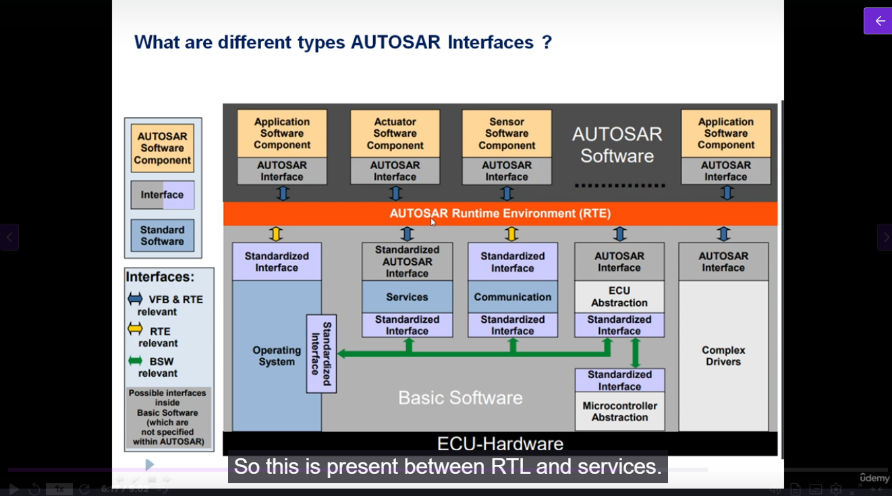

- Thì AUTOSAR Interface sẽ là kiểu nói về giao tiếp giữa các SWCs hoặc SWC với BSW thông qua việc mình định nghĩa port. Và cái AUTOSAR Interface này chính là nơi mình định nghĩa các port đóa, còn các interface mà các port hay liên kết là khác nó nằm trong AR-PACKAGE (là do Autosar quản lý), không thuộc SWC nào cả.

- Standardized Interface: là 1 cái interface là được định nghĩa từ trước bởi tiêu chuẩn Autosar được coi như là API giữ các lớp BSW và sử dụng ngôn ngữ C. Tức là nó là mấy cái DIO_Write .. tiêu chuẩn đóa, thì mấy cái tiêu chuẩn đóa là do mình viết, nhưng đối với những người viết layer trên như SWC là nó được định nghĩa từ trước ròi. Đóa thì ngoài việc sử dụng giữa các SWC, nó còn sử dụng giữa RTE và OS hoặc RTE và BSW module.

- Standardized AUTOSAR Interface: Thì đây là 1 Interface đặc biệt của Autosar, nó sẽ có các hàm được định nghĩa bởi Autosar standard. Và nó được sử dụng cho việc các SWC truy cập vào các AUTOSAR service( nó nằm ở lớp BSW - Service Layer) như ECU State Manager hay Chuẩn đoán Diognostic Event Manager.

</details>

<h2><summary>3.4. AUTOSAR Methodology</summary></h2>
<details>

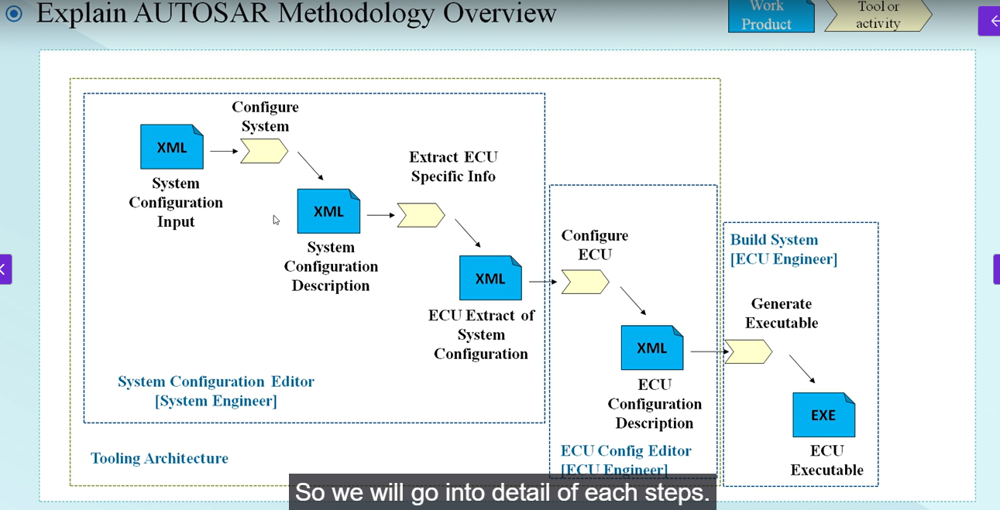

1. System configuration

Nó sẽ gồm 2 file XML và sẽ có quá trình configure system từ file system configuration input.xml config sang system configuration decription.

Thì cái system configuration có mục tiêu là thông nhất giữa các SWCs mà mình mô tả qua autosar tool hay là system inputs(XML) với các hardware trong ECU dựa vào file schema (XSD) của hệ thống Autosar

- System configuration Input thì nó gồm cái gì? Thì theo t được biết nó sẽ chính là các file arxml mà mình thiết lập tức là nó sẽ chứa các thông tin thoi và nó sẽ ràng buộc với file hệ thống(như kiểu nếu khai báo SWC này phải bắt buộc chạy trên ECUx, tương đương cũm rằng buộc về bus ròi vì phần mềm cũm phải thông qua bus thoi), như thông tin các SWC, các giao tiếp communication matrix (mô tả truyền dữ liệu qua CAN, LIN,..), System Description là cái SWC này sẽ có những port nào kiểu kiểu vậy. Thì tức là mới là thông tin thoi, giống kiểu m có 1 đống tài liệu nhưng m đưa cho ai thì chưa biết.

- Đó thì thông quá bước config system là quá trình liên quan tới việc mapping các cái System elements tới các Software elements(tức là mapping những cái signal hay các đường bus trong ECU với lại software của mình í) nó sẽ tạo ra system configuration Description 

- System Configuration Decription nó sẽ nói về có bao nhiêu ECU trên hệ thống và chúng ta kết nối chúng như nào vào các ECUs và 1 cái SWC sẽ dùng những port nào, interfaces nào hay frame truyền sẽ như nào, và các SWC sẽ mapping vào ECUs nào. Thì nói về ECU Extract thì nó thay vì kiểu nhìn toàn bộ hệ thống thì nó sẽ chỉ quan tâm tới 1 ECU cụ thể.

2. Extraction of the ECU specific information

- Tức là thông qua cái quá trình Extract ECU Specific Info nó sẽ tạo ra nhiều file xml ECU Extract of System Configuration, và cái file này nó chứa các thông tin tương tự cái system configuration decription nhưng mà nó sẽ chỉ chứa thông tin của 1 ECU duy nhất.

3. ECU Configuration

Tức là quá trình này nó sẽ có 1 cái config ECU và tạo ra file ECU Configuration.

Nó sẽ kết nối ECU tương ứng với BSW tương ứng tới tầng RTE (tức là như nào thì ECU này có thể làm việc với ECU khác mà, nên là bước này giống kiểu ECU nào cần BSW của cái nào sẽ gửi thông tin chứ chưa kết nối), nhằm tạo kết nối giữa SWC và BSW. Và để kết nối với BSW thì sẽ có 1 file Basic Software Module Description.

4. Generation of module configuration

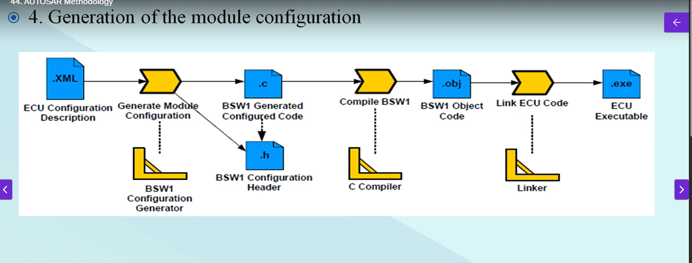

Thực ra đây là 1 cái khá mới so với khóa kia nhưng mà t nghĩ nó cũm như trong C thoi, thì nó sẽ tạo ra các file BSW.c, BSW.h tương ứng và cái ECU nào cần thì chỉ cần link cái object đó vào để dùng và tạo ra file thực thi là ECU Executable.


5. AUTOSAR Methodlogy Summary

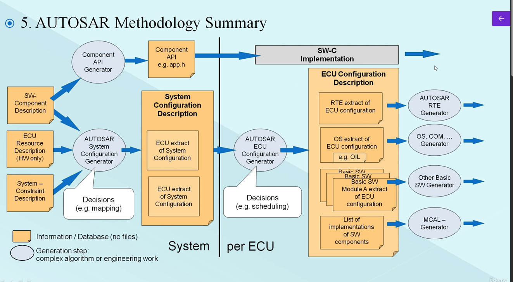


Cái ảnh này nó overview toàn bộ luôn
</details>

<h2><summary>3.5. Conformance Classic (lớp tuân thủ)</summary></h2>
<details>

Tức là cái phân loại ở đây muốn phân loại về kiểu chức năng ấy, có 1 số module như sensor temp chẳng hạn nó chẳng cần phải lưu vào NVM, hay check diagnostic, mà thông thường nó sẽ trực tiếp ghi giá trị vào SWC chẳng hạn.
Nói thêm nữa tại sao lại có cái này, cảm giác nó bị phá cái Autosar như cái ICC1 đúng không? Nhưng mà kiểu mấy cái ECU đơn giản như đọc mỗi cảm biến thoi mà làm theo quy chuẩn nó sẽ lằng nhằng hơn, thì ngta mới chia ra các loại cho mn dễ hiểu. Kiểu nói với thằng kia đây là ICC1 đấy, không có RTE đâu, code thẳng đi, kiểu vậy.


- ICC1: Thì nôm na ban đầu là RTE và BSW sẽ là 1, tức là SWC sẽ làm việc trực tiếp xuống dưới luôn, đương nhiên là không đúng quy chuẩn với Autosar rồi, nhưng nó phù hợp với các ECU chi phí thấp như sensor thoi. Thì cái như nào là ICC1 thì nó sẽ không có Diagnostic, NVRam, Routing hoặc có thì có LIN, CAN đơn giản. Thì nó sẽ gộp build chung với RTE, vì chẳng cần tách ra để reuse.


dmm cái này xem lại sau(YT có giair thích)

</details>

<h2><summary>3.6. Autosar Use Case</summary></h2>
<details>

</details>
<h2><summary>3.7. Migration Stategies</summary></h2>
<details>

Này nó liên kết phần 3.5 (xem thử trên YT)
</details>
</details>

<h1><summary>4. RTE</summary></h1>
<details>

<h2><summary>4.1.RTE Entities - SWC, Composition, Ports</summary></h2>
<details>

Thì bài này nói về các loại SWC thì có 3 loại chính là Atomic, Parameter, Composition SWC:
- Nói về Parameter SWC là kiểu cung cấp các value chuẩn mà mình đã thiết lập từ đầu cho các SWC khác, và Paramater SWC sẽ không có khả năng thực hiện như viết hàm các thứ
- Nói về Composition SWC: thì nó sẽ chứa các SWC khác là các Atomic SWC đóa, thì việc nhóm này để gọi là cho nó trừu tượng, VD: Điều khiển quạt tản nhiệt chẳng hạn, cần tới 2 SWC (1 SensorActuator SWC để đọc dữ liệu từ sensor và 1 ECU Abstraction cho I/O của ECU -> gộp vào dễ quản lý).
- Nói về Atomic SWC thì nó sẽ là SWC thấp nhất và làm việc với RTE or layer dưới (nó sẽ chia thành 7 loại):
    - Application SWC: thì đây là 1 cái SWC bình thường thoi, làm những công việc ứng dụng.
    - SensorActuator SWC: Đây là SWC dùng để xử lý sensor và actuators.
    - Service Proxy SWC: Service ở đây giống như là server là người cung cấp hàm cho các client khác. Nhưng mà đối với Service Proxy nó sẽ không chưa service thật, nó giống như là người đứng ở ngã 3 và chỉ 2 hướng còn lại tới service thật. Nghĩa là sẽ có thể có nhiều ECU truy cập vào service proxy.
    - Service SWC: Còn đối với Service SWC này thì nó chính là Service thật, nó sẽ ở yên đợi client xin, hoặc service proxy sẽ lấy nó.
    - ECU Abstraction SWC: Thì nó sẽ làm việc trực tiếp với BSW modules, làm việc trực tiếp với I/O mà không thông qua RTE. Có mỗi cái SWC này làm được việc đóa thoi.
    - Complex Device Driver SWC: Thì làm việc với CDD thoii.
    - Nvblock SWC: SWC này để làm việc với bộ nhớ

Bài này còn nói qua về Port: sẽ có Provider Port và Receive Port (PPort và RPort) đơn giản đây là phương tiện giao tiếp giữa các SWC hay SWC với BSW ỵoi.
</details>

<h2><summary>4.2.Connector</summary></h2>
<details>

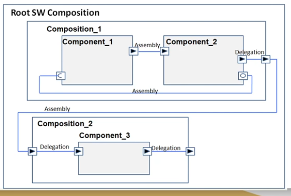

Thì cái định nghĩa conector này là nó được dùng khi mình dùng Composition SWC thoi thì sẽ có 2 loại connector
- Đầu tiên là Assembly Connector: Thì nó là kiểu connector giữa các SWC bên trong cùng 1 composition SWC. Và giữa 2 Composition cũm có thể dùng Assembly Connector có thể xem ảnh để hiểu cho rõ
- Còn Delegation Connector nó sẽ xuất hiện khi ta muốn giao tiếp giữa các SWC ở Composition khác nhau. Thì để giao tiếp được với nhau thì phải thông qua Composition. Và chúng ta kết nối SWC mà cta muốn giao tiếp tới Composition hiện tại bằng Delegation Connector (xem ảnh).
</details>

<h2><summary>4.3.Internal Beaviour-Runnables</summary></h2>
<details>

Thì cái này t thấy trong file arxml rồi
Thì cái này nói về cách hoạt động bên trong SWC cụ thể sẽ là 7 cái SWC trong Atomic SWC.

Trong cái này nó sẽ có Runable Entity, RTE event, Exclusive Areas

**Runnable Entity**

- Đầu tiên với Runable thì nó được coi như là 1 function thực hiện các chức năng, thì trong Runable có thể có nhiều Runable với các chức năng khác nhau hoặc được gọi ra 1 cách khác nhau như event (sẽ nói ở bên dưới), thì các runnable này được đặt tên hoặc đặt ở đâu hay sẽ được gắn cho event nào sẽ được config bởi AUTOSAR file arxml. Thì trong Autosar, mọi thứ đều được configuration based, vì vậy mọi thứ đều kiểu static. Thì theo đúng quy trình là các runnable phải được configure, các port cũm được configure, xong rồi sẽ được generated, và sẽ tạo ra các runnable file C và ta sẽ viết data vào trong đấy. Và trong quá trình run-time, mình dell thay đổi gì được vào autosar. Thì sẽ có 3 loại Runable:
    - Init Runnable: Là các runnable được định nghĩa là khi khởi tạo 1 cái ECU, nó sẽ được gọi đến để khởi tạo biến cấu trúc nội bộ .. và được gọi đúng 1 lần khi khởi động ECU, nên nhớ runnable là 1 cái hàm và cái init ở đây nó sẽ giống như là GPIO_Init đấy :)) thì mình vẫn phải viết ra. (InitEvent)
    - Periodic Runnable: Tức là cứ tới 1 thời điểm nào đó sẽ gọi Runnable đó 1 lần (Timing Event)
    - Server Runnable: thì runnable này chỉ chạy khi có kiểu service Client/Server thông qua port interface. (OperationInvokedEvent)


**RTE Events**

Thì các cái configured của runnable sẽ được kích hoạt bởi RTE events có 6 loại:

- Timing Event: thì đây là các sự kiện kiểu định sẵn thời gian, kiểu trong khoảng thời gian bao nhiêu chạy đến runnable đấy hoặc runnable đấy chạy được bao lâu.
- Operation Invoked Event: thì tức là 1 cái sự kiện của client và server, 1 cái client sẽ gọi cái server liên quan, thì nó sẽ sinh ra event ở server service.
- Mode Switch Event: tưc là trước khi mình thay đổi 1 cái mode gì đấy ở ECU, thì nó sẽ thực hiện 1 cái runnable nào đó trước khi switch. Giống như kiểu mình muốn switch shotdown mode của ECU, thì nó sẽ chạy tới 1 runnable lưu data hiện tại chẳng hạn rồi mới chuyển đổi.
- Data received event: tức là nó sẽ kích hoạt 1 cái runnable khi mà cái data, mà từ PPort gửi về done, thì nó sẽ kích hoạt runnable liên quan đến cái PPort và kích hoạt RPort thông qua runnble đó lấy cái data đấy.
- Data received Error Event: thì như cái tên :)) data nhận bị lỗi thì sinh ra Runnable.
- Data send completed Event: như cái tên tiếp thì khi gửi data hoàn thành tạo 1 cái runnable thông báo.

</details>

<h2><summary>4.4.RTE Overview</summary></h2>
<details>

Nói chung là nó giới thiệu về RTE thoi.

</details>

<h2><summary>4.5.Sender Receiver Interface</summary></h2>
<details>

Nói qua về Interface trước thì nó được config trong arxml, thường thì nó sẽ nói về sự liên kêt giữa các port. Các port có cùng interface sẽ liên kết với nhau, và port với interface sẽ cùng nhau gen ra các hàm C.

Thì có 6 Interface chính như sau:
- Sender Receiver Interface: là interface dùng cho truyền nhận data giữa các port, thì data ở đây thông thường là 1 cái biến thoi. Thì bên gửi sẽ gửi dât còn bên nhận làm gì thì không biết, nên nó sẽ có kiểu 1 cái data sẽ nhiều bên nhận.
- NV Data Interface: là interface dùng cho việc truyền nhận data từ flash (các data không bị biến mất lúc shutdown). Còn việc yêu cầu data từ flash như nào là do mình. Mình muốn cái SWC đấy chỉ đọc data hoặc chỉ gửi data, hoặc cả 2 thì do mình config.
- Mode Switch Interface: thì cái interface này dùng cho trạng thái hệ thông như RUNNING, STANDBY. Thì như ta đã nói về mode switch event nó sẽ kích hoạt khi trạng thái hệ thống thay đổi. Thì đây khi hệ thống thay đổi nó sẽ gửi data về Interface này và sẽ kích hoạt cái runnable sử dụng cái mode switch interface.
- Client Server Interface: thì Interface này là kiểu Client sẽ gọi 1 cái hàm giống như function call á, kiểu mình từ hàm main xong gọi đến hàm đó để chạy, ròi lại về hàm main để tiếp tục, kiểu kiểu vậy á. Thì cái client sẽ gọi 1 cái function từ service thoi.
- Parameter Interface: là Interface dùng cho việc trao đổi giữa runnable và data của hệ thống(được cofig sẵn ngay từ đầu chỉ đọc, không ghi).
- Trigger Interface: thì cái này giống kiểu có 1 cái lỗi gì đó của hệ thống thì nó sẽ tự trigger cái runnable này (diagnostic sẽ là nơi có thể sẽ kích hoạt cái runnable này) với lại m nhìn mấy cái event ấy, có mấy cái event error thì khả năng chính là sử dụng interface này.


Ở bài này còn nói về có 2 comunication là implicit và explicit.
Ngoài ra còn có Supports data distribution (Unqueued) và Event distribution (Queued).
</details>

<h2><summary>4.6.Queued vs non queued communication(thấy được sử dụng trong Sender-Receiver)</summary></h2>
<details>

Thì nó nói về cái quá trình truyền nhận của sender-receiver đấy.

Thì kiểu nó có thể có nhiều bên gửi sender và 1 bên nhận reiceiver, vậy phân bố các cái data được gửi đến đấy như nào.

**Queued communication**
- Thì giao tiếp theo trình tự thành nào gửi trước thì lấy trước theo đúng cơ chế FIFO (First in first out).

**Unqueued Communication**
- Thì nếu không queuce thì nó sẽ kiểu lấy dữ liệu của cái mới nhất, ví dụ có 2 sender 1,2 và cái sender 2 là cái mới gửi vào nhất. Thì nó sẽ nhận sender 2 và sender 1 sẽ bị mất dữ liệu.
</details>

<h2><summary>4.7.Implitcit vs Explicit Communication(thấy được sử dụng trong Sender-Receiver)</summary></h2>
<details>

Được rồi thì nước trước là phần này nó thường được nằm trong Sender-Receiver Interface
Đó thì nó sẽ nói về 2 cái Implicit và Explicit Receive
- Về Implicit tức nghĩa là nó sẽ cố định cái buffer cho 1 RPort, cố định port nhận với với port gửi. Và cái buffer đấy nó sẽ lấy cái giá trị từ port gửi trước và sau khi excecution (execution là quá trình runnable có RPort chạy). Và trong cái runnable của RPort mình không cần phải gọi ra cái hàm(hay runnable) của bên gửi mà chỉ cần lấy buffer, là có dữ liệu. Và việc cố định này nó sẽ chỉ tốt cho việc mình muốn giao tiếp 1-1 và các port khác sẽ không đụng vào.
- Về Explicit thì nó sẽ không có buffer cố định, tức là khi mà cái runnable của bên nhận nó chạy thì mình mới lấy dữ liệu của bên gửi trong cái runnable đấy. Và việc lấy dữ liệu là mình sẽ gọi hẳn hàm(hay runnable) của bên gửi, thay vì chỉ gọi buffer như Implicit. Thì việc này sẽ giúp bên nhận có thể có nhiều bên gửi, vì nó không bị config cứng giữa các port. Thì đương nhiên việc port nhận nào sẽ có những port gửi nào, vẫn phải được config trong file arxml ròi. Nhưng mà thay vì giao tiếp 1:1, thì giờ giao tiếp được nhiều thoi. Và khi bị config cứng như vậy t đoán kiểu bên nhận nó sẽ có 1 cái buffer riêng do Autosar cung cấp và khi gọi cái hàm nào thì cái buffer riêng đó sẽ lấy dữ liệu có cái hàm gửi đó và thực hiện thoi, chứ không phải như Implicit là chỉ được lấy 1 cái buffer của bên gửi thoi.
</details>

<h2><summary>4.8.Client-Server Interface</summary></h2>
<details>

Ở đây ta sẽ nói qua về Interface này, nó sẽ có 2 loại synchronous and asynchronous

- synchronous thì là gọi hàm bên server xong chờ cho nó xử lý xong mới quay lại client làm tiếp. Thì nó sẽ giống như trong C thông thường thoi.

- asynchronous thì gọi hàm xong cái, thì kệ đó nó chạy mình quay về làm tiếp ở phần client. Thì ví dụ hàm bên ấy có cái dữ liệu gì trả về thì lưu vào buffer của sender-receiver thì cứ có data biến là phải dùng sender-receiver rồi

Còn việc nó thực hiện như nào thì nói bên trên ròi client gọi và server sẽ thực hiện cái service(hay hàm) mà client yêu cầu (nó được config sẵn trong AUTOSAR arxml).
</details>

<h2><summary>4.9.Communication between SWC and BSW</summary></h2>
<details>

Hmmm thì cái này nó nói về giao tiếp giữa SWC và BSW thoi, thì nó sẽ use các cái Interface như Server, hay sender-rêciver interface như bthg, và phải thông qua RTE.
</details>

<h2><summary>4.10.Intra & Inter ECU Communication</summary></h2>
<details>

Ở đây sẽ giới thiệu 2 cái:
- Intra ECU Communication via RTE: tức là đây là giao tiếp giữa 2 hoặc nhiều cái SWC trong 1 ECU, nhớ đó 1 ECU thoi nên nó chỉ thông qua RTE là tới cac SWC.
- Còn Inter ECU Communication via RTE & BSW: đây là giao tiếp giữa 2 hoặc nhiều SWC mà khác ECU. Thì để giao tiếp được nó phải thông qua lớp RTE và đến các COM(hay các giao thức như CAN, LIN) dưới BSW để giao tiếp với ECU khác.

</details>


<h2><summary>4.11 RTE Generation</summary></h2>
<details>

Hmmmm thực ra bài này cũm được nó nói về cách các RTE đặt tên :v nhưng mà lười quáa lúc nào xem lại rồi ghi lại sau


Oke thì RTE Generaion sẽ có 2 giai đoạn chính: RTE Contract Phase và RTE generation Phase.

- Đầu tiên là giai đoạn RTE Contract: Thì đây là giai đoạn mà chúng ta sẽ gen ra các API hay các file header (.h) Thì để t ra file.h đương nhiên RTE sẽ phải dựa vào SWC này, dựa vào Port, dựa vào Interface của các SWC, và cách các SWC kết nối. Và từ đó sẽ Gen ra file.h. Vậy thì có những thông tin gì từ 1 SWC:
    - Component Type Description : mô tả loại SWC(ví dụ nó là application hay ECUAbstraction SWC)
    - Component Internal Behavior Description: mô tả các runnable, RTE events các kiểu đóa.
    - The actual source and/or object code: ý muốn nói mình muốn config cho tên các cái source hay cái object code như nào?
    - Component Implementation Description: Này là mô tổ các cái SWC thực hiện như nào, như là nối port này với port nào,...
    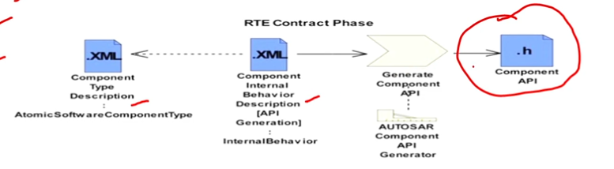

    - Thì nhìn vào bức ảnh này ta thấy 2 file xml, 1 cái mô tả về SWC, 1 cái sẽ là của Interface(hay Internal Behavior), thì 2 cái file này nó giống như cái ví dụ demo ở bên khóa kia -> thì kết hợp 2 file này vào sẽ tạo ra file.h

- Tiếp theo đến giai đoạn RTE generation Phase thì nó sẽ chia là 2 section:
    - RTE Configuration Editing: Tức là cái section này sẽ tổng hợp các cái thông tin cần thiết từ quá trình ECU Configuration Description và từ đó config xuống dưới tầng BSW các thông tin cần thiết cho hệ thống như COM và OS. Và viện ECU Configuration Editor sẽ liên tục làm việc là tổng hợp các cái dữ liệu từ ECU Configuation Description đến khi mà việc config những thứ cần thiết cho BSW được hoàn tất hay được giải quyết. Khi các vấn đề config được giải quyết thì sẽ đến giai đoạn RTE Generator lúc này RTE thật sẽ compiled và linked các phần ở BSW với SWC.
    - RTE Generation Phase: thì giai đoạn này là lúc mình tạo ra các luông RTE thật sự là file.c


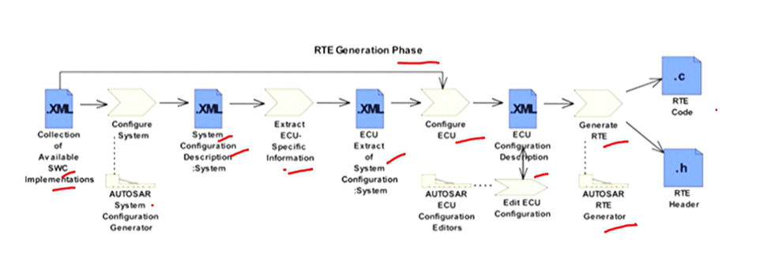

-> Thì theo chat GPT cũm như theo như t ghi thì các giai đoạn tổng hợp sẽ như sau thì RTE Constract sẽ xác định các cấu trúc SWC, port, runnable, ... tức là chỉ nói tới các thông tin và tạo ra các VFB sinh ra file.h, tiếp theo sẽ đến RTE Configuration Editer sẽ là config các tầng bên dưới, như init(), hoặc là nó sẽ kết nối SWC vào các ECU hay mapping port,.. Còn RTE Generation nó sẽ tạo ra các file.c tạo ra cái luồng dữ liệu thật sự. Mặc dù nói các giai đoạn tạo ra file.h, file.c nhưng trên thực tế đến lúc hết 3 cái giai đoạn kia nó mới tạo ra các file.h, file.c thực sự, các giai đoạn chỉ là ngầm định thoi. Coi như cái RTE Generation Phase chính là giai đoạn tổng hợp tất cả các thông tin phía trên để tạo ra các file thật sự. Đây thì hình ảnh bên dưới cũm chỉ rõ sự ngầm định đóa, bằng việc chỉ RTE Contract Phase là Application Header(.h)

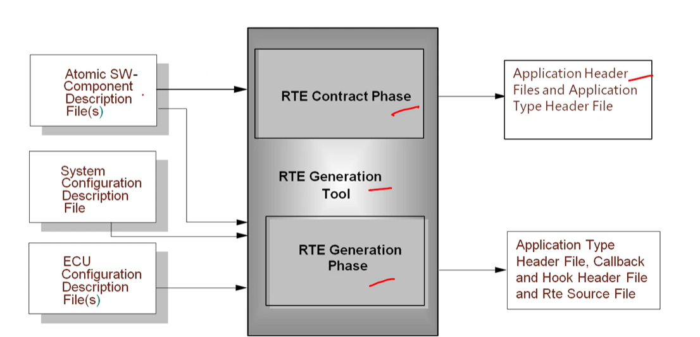


Thì vừa này là quá trình còn bây h ta sẽ nói về các file.c, file.h được tạo ra có những file nào và chức năng

- Rte.c: thì file này sẽ tạo ra các biến(instance) của những struct được sử dụng cho mỗi SWC mà RTE tạo ra và ngoài ra còn các API hay hàm gọi ra các SWC được khai báo trong đó. (thực ra cái này muốn rõ hơn thì xem lại video)
- Rte_Type.h: thì nó là kiểu dữ liệu trong AUTOSAR mà mình định nghĩa lại.
- RTE Application Header File: thì file này sinh ra là header file của 1 Atomic SWC, và khi nào dùng đến SWC tương ứng mình gọi file.h tương ứng để lấy các biến các hàm liên quan 'RTE_<SW-Component name>.h'
- Rte_Hook.h: đây là header của VFB Trace, thì cái VFB Trace nó sẽ theo dõi quá trình truyền nhận, trao đổi thông tin giữa các SWC, hoặc những SWC qua tầng RTE, file này được tạo ra khi mình enabled VFB Trace.
- Rte_Cbk.h: cái này nó sẽ chứa các hàm callback, tức là các hàm kiểu như ngắt ấy, kiểu trong nhiều trường hợp, BSW layer,hoặc RTE không trực tiếp điều khiển các hành vi mà cần phả gọi 1 hàm nào đó như kiểu có tín hiệu CAN đến, thì RTE hay BSW sao biết luoon được và cái RTE Application cũm không biết trước, thì cần những file.h này để biết.


</details>
</details>

<h1><summary>5. Startup and Shutdown Sequence</summary></h1>
<details>

<h2><summary>5.1. Startup Sequence</summary></h2>
<details>

Oke nói về quá trình start up thoii, cơ bản cũm dễ hiểu nhiều step, nên xem nhiều để nhớ thoi. Thì t sẽ nói ngắn gọn như trong video luôn.

Đầu tiên bật nguồn đúng không thì nó sẽ phân bổ bộ nhớ các thứ thì tiếp theo nó sẽ vào cái bootloader chính của hệ thống để nhảy vào Boot Manager và để check xem hệ thống có gì hay chưa, nếu có thì nhảy tới application main và check 1 cái application và check tiếp xem nó có bắt lập trình lại không và nếu không thì mình qua Bootloader thoi. Tiếp theo ta sẽ nói về trong cái main function của Autosar thì có EcuM (cái này sẽ có hẳn mấy bài bên dưới), và EcuM sẽ được gọi và nó bắt đầu init Cdd và 1 số BSW modules. Và sau đó OS sẽ chạy và bắt đầu tự động chạy các task. Bằng việc vào cái Schm init function (Schm_init()) để chạy định kỳ các task BSW, kiểu nên kích hoạt BSW module nào trước nào sau đóa và khởi tạo BswM. Tiếp đến NvM_ReadAll được init trong vòng lặp do-while (này là gửi dữ liệu từ flash lên RAM). Và các modules mà dựa vào việc NvM_ReadALl hoàn thành như Dem(Diagnostic event manager) được khai báo. Sau đó SWCs sẽ được khai béo trước gọi là quá trình thực thi application. Tiếp đến WdgM(Watchdog Manager) sẽ được khai báo và RTE sẽ được chạy bằng việc bắt đầu API.

Và dưới đây ta sẽ nhìn tổng quan về qus trình startup và có nhiều câu hỏi như BswM_Init, ECuM Init là cái gì và nó nằm ở đâu, thì mình sẽ giải đáp sau.
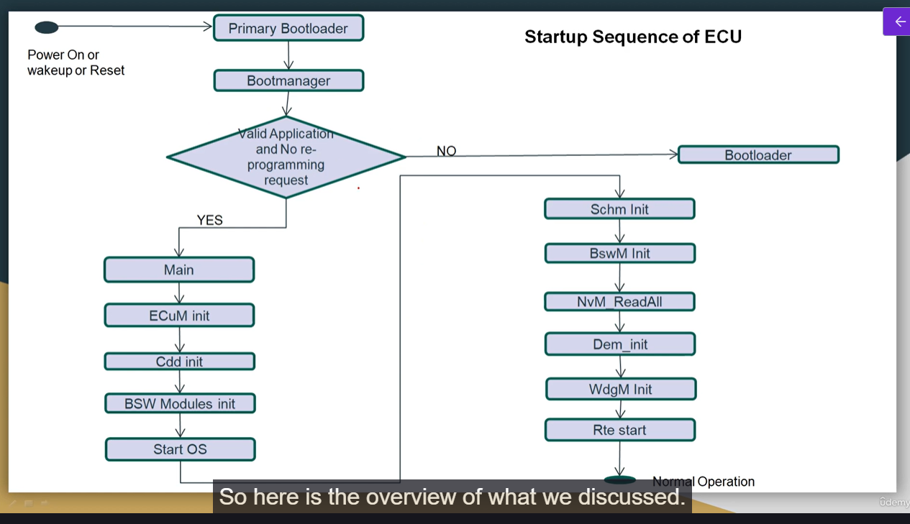


**Kết luận**

Thì việc startup sequence cho 1 ECU sẽ được xử lý bởi ECU Manager module or EcuM. Thì EcuM nó sẽ chịu trách nhiệm cho viẹc init cái gì cũm như không định nghĩa gì cho toàn bộ ECU. Và trong việc thực hiện 1 ECU sẽ có 3 layer chính là BSW manager, Autosar OS, and the Scheduler Manager(SchM). Do đó thì EcuM cũm sẽ chịu trách nhiệm init cũm như deinit cho cả 3 layer kia luôn, cũm như 1 số module BSW cơ bản. Thêm nữa EcuM cũm chịu trách nhiệm cho việc xử lý các trạng thái của ECU như SLEEP hay SHUTDOWN state

-> Tức là EcuM sẽ quản lý vòng đời của 1 ECU và cách khởi tạo, tức là nó sẽ là người hướng dẫn cho ECU đó.
</details>

<h2><summary>5.2. Shutdown Sequence</summary></h2>
<details>

Thì đầu tiên sẽ có 1 communication bật lên để yêu cầu các quá trình phải disable và sau đó trình ECU Manager sẽ chuyển đổi trạng thái ECU sang POST RUN. Và 1 cái BswMCallouts được thiết lập để lưu các thông tin application của BSW modules trước và sau khi hủy khởi tạo (deinit). Tiếp theo là sẽ lưu hết các thông tin về Flash bằng việc sử dụng NvM_WriteAll trong 1 vòng lặp do-while. Sau đó phụ thuộc vào cái shutdown target, the sleep và the MCU perform reset API sẽ được gọi.

Lưu ý là nếu trong quá trình shutdown phase mà có 1 sự kiện wakeup, thì ECU Manager module sẽ hoàn thành việc shutdown và restart ngay lập tức

Ảnh dưới đây để thấy rõ các bước shutdown sequence.
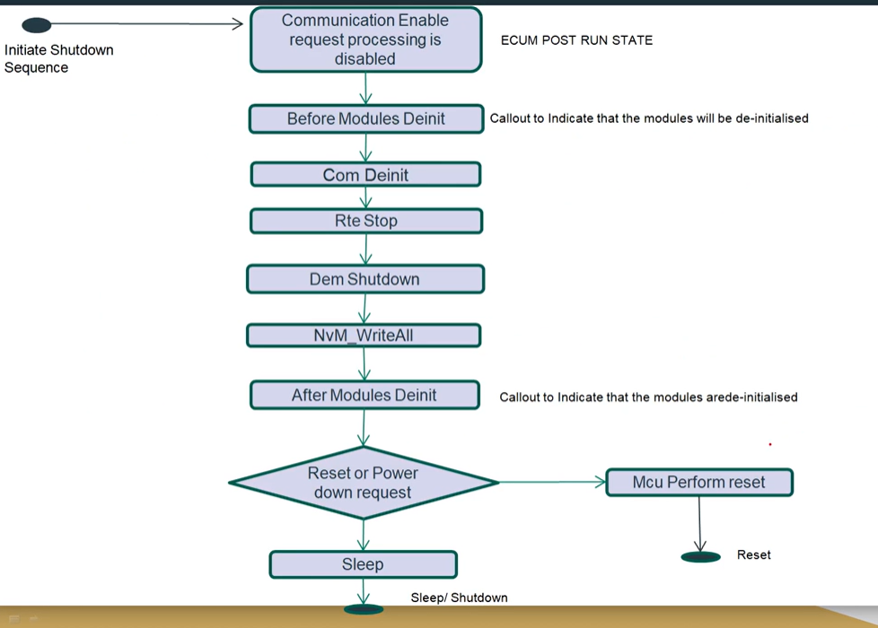

</details>
</details>

<h1><summary>6. ECUM Modules</summary></h1>
<details>

Thì ở phần này mình sẽ giải quyết tương đối về các cái khó hiểu từ phần trước, và có những cái thuật nghĩ ở phần trước tiếng Anh mình nói bằng tiếng Việt nên đọc lại phần trước chỉ là để tham khảo qua sequence, còn từ phần này sẽ hiểu sâu về việc sequence thực hiện như nào,

<h2><summary>6.1 ECUM Introduction and Fixed ECUM</summary></h2>
<details>

Thì nói qua về ECU Manager thì đây là 1 module quan trong trọng việc quản lý vongf đời ECU. Thì nó sẽ có chức năng cơ bản sau:
- Init và deinit OS, SchM (Scheduler Manager) và BswM cũng như 1 số các module BSW.
- Config ECU ở chế độ SLEEP hay SHUTDOWN.
- Quản lý tất cả các sự kiện wakeup trên ECU.
- ECU Manager module cung cấp cái protocol để phân biệt hay kiểm định được đou là sự kiện real wakeup và đou là eratic(giả) event.

Nói thêm về wakeup event thì nói về cái này khá nhiều nãy h là nó là tín hiệu đánh thức ECU từ chế độ Sleep/Low-power trở lại trạng thái hoạt động(Run). Việc Wakeup này có thể đến từ CAN bus nhận dữ liệu, nút nhấn, timer, cảm biến, tín hiệu điện áp ngoài. Còn việc Wakeup Event giả(erratic) là kiểu nhiễu xảy ra làm tác động đến các chân wakeup đó.

**Sự khác nhau giữa Fixed EcuM and Flexible EcuM**
- Đầu tiên như cái tên thì Fixed EcuM là nó sẽ fixed cứng quá trình chạy của ECU kiểu Startup -> RUN -> Sleep. Và Fixed EcuM chỉ có 3 states chính thoi là OFF, RUN, SLEEP và sự chuyển đổi giữa các trạng thái này là STARTUP và SHUTDOWN. Thì với việc là nó cố định như này thì fixed EcuM chỉ phù hợp với những ECU không yêu cầu đặc biệt như startup 1 phần hoặc startup nhanh. Và Fixed ECUM không hỗ trợ cho ECUs có multi-core.
- Về flexiable EcuM thì mạnh mẽ hơn và tập hợp trạng thái cố định và chuyển đổi giữa chúng để cho phép các tình huống sau:
    - Partial startup or fast startup(thì cái đấy là nó sẽ khởi động 1 phần của hệ thống những cái cần thiết, còn fast thì khởi động toàn bộ nhưng với tốc độ nhanh)
    -Có nhiều trạng thái (operational state) và có nhiều core trên 1 ECU nên mỗi nới có thể có trạng thái khác nhau như STARTUP, SHUTDOWN

Giờ hình ảnh này sẽ nói rõ hơn về các States trong Fixed ECUM:

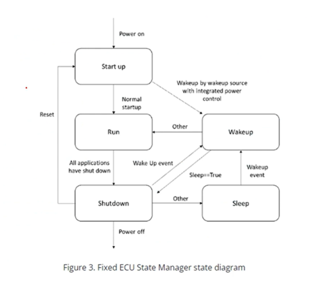

Nói qua về các trạng thái khá quan trọng:
- Startup state: nó sẽ chia trạng thái thành 2 phần, 1 là trước khi OS được init và sau khi OS được init. Mục đích của Startup là khởi tạo BSW modules.
- RUN State: Sau khi tất cả các module của BSW gồm OS và RTE được init, thì EcuM sẽ vào trạng thái RUN state. Nó se chỉ định các SWCs trong Application layer là sẽ liên quan tới các RTE and BSW đã được init. Và bây h nó có thể bắt đầu chạy các chức năng.
- Shutdown State: Nó sẽ xử lý và kiểm soát quá trình shutdown của BSW modules. Và kết quả là sẽ đưa ra 3 cái target cho ECU là SLEEP, OFF, or Reset. (thì 3 cái trạng thái này như cái tên của nó nên không làm).
- Wakeup State: Là sự kiện xảy ra khi ta bị đánh thức khi đang ở trạng thái SLEEP. Thì ở trạng thái này nó sẽ kiểm tra xem sự kiện đánh thức kia là đúng hay giả vờ, vì thi thoảng sẽ có các điều kiện lỗi làm đánh thức hệ thống.
</details>

<h2><summary>6.2 Flexible EcuM states </summary></h2>
<details>

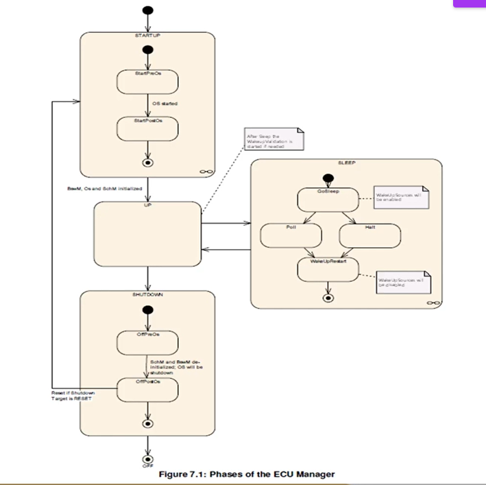

Thì nhìn vào cái này nó khá rối :v nhưng về cơ bản trước thì nó sẽ có 4 phần chính là STARTUP, UP, SHUTDOWN, SLEEP (trong các phần này sẽ có nhiều phần nhỏ khác ta sẽ phân tích sau).

- Startup Phase: thì nhìn nó khá giống với cái fixed sẽ có 2 phần trước và sau OS init. Mục đích chính của START phase là init các cái BSW khác nhau.
- UP Phase: Thì vào giai đoạn này sẽ là giai đoạn bắt đầu chạy OS và hoàn thành quá trình init SchM và BswM.
- Shutdown Phase: thì quá trình này đơn giản là quản lý quá trình shutdown các BSW modules thoi, và sẽ chọn 2 target state OFF or Reset thay vì 3 như fixed EcuM.

</details>

<h2><summary>6.3 Start up phase </summary></h2>
<details>

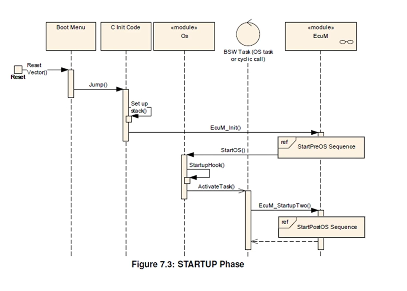

Thì cái hình ảnh trên nói về giai đoạn startup kĩ hơn, kiểu trước và sau OS init chuyện gì xảy ra. Được rồi giờ ta sẽ nói sẽ từng phần

- Activities prior to EcuM_init: đây nói về hành động trước khi vào EcuM_init, dựa vào hình để biết rõ hơn. Thì khi ECU được bật thì MCU sẽ init, đầu tiên nó sẽ nhảy tới vector table để mà chạy quá trình bootloader code. Kiểu trong quá trình bootloader mình biết là quá trình đẩy code vào hệ thống như kiểu khởi tạo bảng vector table(trong đó có khởi tạo vùng stack), đẩy dữ liệu từ memory lên RAM, init những BSW modules cơ bản (kiểu các module nó không liên kết với nhau hoặc không liên quan đến OS là các module cơ bản), thì việc init này sẽ được thực hiện bởi code C. Đó thì ngoài ra nó còn khởi tạo các C variables. Và sau đó sẽ call tới EcuM_Init() đây là 1 hàm hay 1 API để gọi tới ECU State Manager và nó sẽ bắt đầu tiến hành quá trình tiếp theo của startup.
- Activities in StartPreOs sequence: Ở giai đoạn này về cơ bản ta sẽ khởi tạo toàn bộ BSW module để bắt đầu OS. Thì quá trình việc nó khởi tạo OS như nào thì sẽ có hẳn 1 cái bảng các hành động trong cái StartPreOs sequence này rùi nó mới gọi tới StartOS(). Thì dưới đây là bảng và ta sẽ nói qua về từng cái
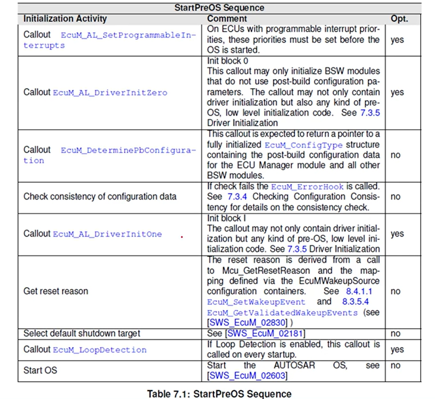

Thì theo lần lượt cái init đầu nó sẽ khởi tạo các cái interrupt priority (giống cái bảng vector table). Tiếp theo init block 0 này nó sẽ gọi các driver init và các cái low level code. Tiếp theo ở quá trình này sẽ thực hiện post-build . Và các bước tiếp theo nó sẽ kiểm tra và hoàn thành các cái modules còn lại. Và cuối cùng sẽ start OS. Bảng bên dưới sẽ đưa ta cái nhìn khái quát về quá trình trong StartPreOS Sequence.


- Tiếp đến StartPostOS Sequence: Thì nó sẽ dựa vào bảng dưới đây chủ yếu nó sẽ khai báo các Scheduler của hệ thống thoi

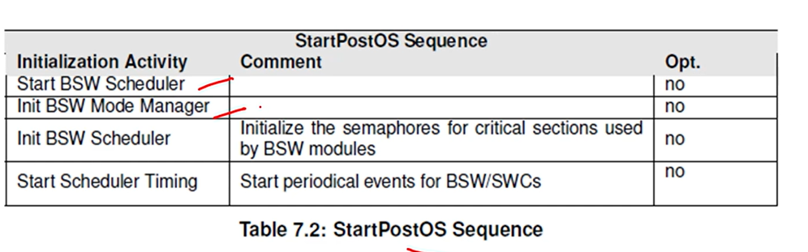

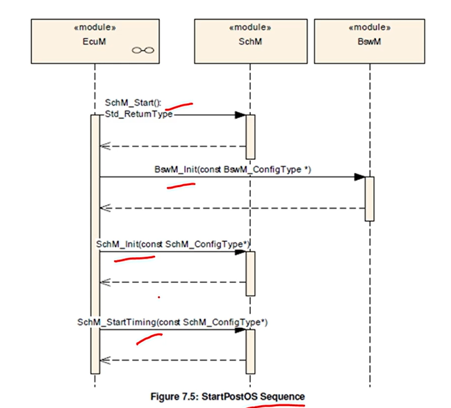
</details>

<h2><summary>6.4 Shutdown phase </summary></h2>
<details>

Thoi phần này xem video chứ dell biết ghi gì.

Về cơ bản là nó sẽ nói về tắt lần lượt cái gì kiểu tắt OS, tắt hook, deinit BSWM, deinit SchM, xong xem có target shutdown không hay có wakeup không. Ncl xem video thì sẽ rõ hơn. Nhưng cơ bản nó cũm chỉ lần lượt như vậy

</details>

<h2><summary>6.5 Shutdown Target </summary></h2>
<details>
Hmmmm phần này chỉ xem thoi, chả có gì đáng để ghi cả 
</details>

<h2><summary>6.6 UP Phase </summary></h2>
<details>

Thì ở cái UP Phase này thì EcuM_MainFunction sẽ được thực thi và có 3 chức năng chính.
- Đầu tiên kiểm tra xem wakeup sources(gồm NONE State, PENDING State, VALIDATED State, EXPRIED State) được woke up chưa .
- Tiếp đến sẽ kiểm tra Alarm Clock Timer
- Và nó kiểu nằm giữa để phân đoạn RUN và POST_RUN
-> Thì cái giai đoạn UP Phase này chỉ yếu sinh ra sẽ là nơi mà wakeup nó sẽ chạy vào đầu tiên khi nó tỉnh lại. Ví cái UP Phase là nằm ở giai đoạn thiết lập xong hết mọi thứ ròi, chỉ việc chạy thoi.

Ở bài còn nói về sơ đồ của Wakeup Source nên có thể xem lại để hiểu hơn, chứ không biết ghi gì.
</details>

<h2><summary>6.7 Sleep Phase </summary></h2>
<details>

NCL cái phần nàu cũm chỉ nên xem video để nó nói về giai đoạn sleep như nào
</details>
<h2><summary>6.8 Mode Handling </summary></h2>
<details>

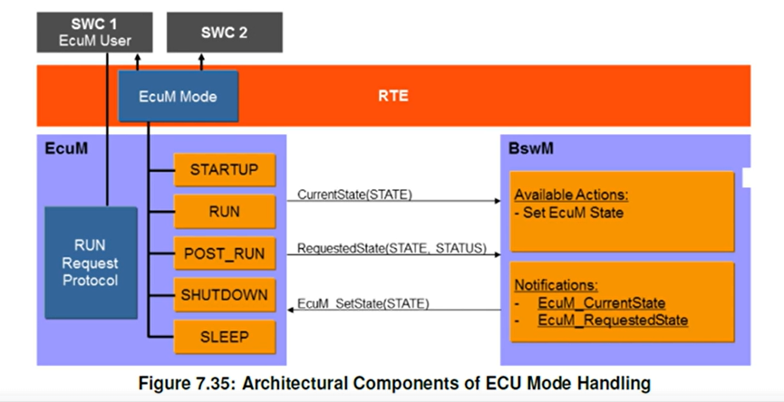

Đây là hình ảnh sẽ cho thấy EcuM sẽ nằm ở đâu trong hệ thống.
Và như ta biết EcuMFlex sẽ phân phối những request và releases được tạo bởi SWCs tới BswM. Sự kết hợp giữa EcuM và BswM là điều bắt buộc vì BswM là người quyết định các trạng thái khác nhau có thể được tạo ra và EcuM chỉ là người nhờ vào BswM để hiện thị các trạng thái đó lên. Uuuu vậy là dựa vào bà trong udemy nói là thật thì BswM sẽ là người cung cấp State. Còn mấy cái Current hay Request State giống như là gửi thông báo chứ không tác động vào trạng thái của State. Kiểu nhiều lúc bên SWC nó cũm muốn yêu cầu State kiểu vậy, kiểu t muốn tắt, m cho t tắt đi :v. Phân biệt giữa release và request ví dụ yêu cầu 1 cái State thì sẽ gọi là released, còn nếu mà mình đã nhận được cái yêu cầu đó thì mình sẽ gửi lại 1 thông báo thì đó là request.

Oke giờ nói về các State:
- STARTUP: khai báo init thoi thì nó sẽ được set bởi RTE whi mà RTE_Start() được call thoi.
- RUN: khi mà các BSW cần thiết được thiết lập thì BswM sẽ chuyển quan chế độ này.
- POST_RUN(là giai đoạn mà chương trình sắp bước vào SHUTDOWN, ở đây sẽ thực hiện 1 số chương trình trước khi tắt): EcuM yêu cầu POST_RUN khi mà việc thực hiện RUN không khả dụng nữa.
- SLEEP: EcuM request SLEEP Mode khi mà việc RUN hay POST_RUN không khả dụng nữa và shutdown chọn target là Sleep
- SHUTDOWN: tương tự như SLEEP nhưng target được chọn ở đây là SHUTDOWN 

Giờ thì cái ECUM cũm sẽ liên quan tới việc Bootloader, cung cấp cho bootloader 2 hàm để Bootloader chọn boot target

Các lỗi sẽ có thể xảy ra trong quá trình startup và shutdown:
- Vấn đề về lỗi config liên quan đến EcuM
- BSWM sẽ chịu trách nhiệm về báo lỗi của nó
- Ngoài ra còn các lỗi Hook như Ram check trong lucs wakeup bị lỗi, postbuild config data bị lỗi, lỗi code-> còn mã lỗi như nào lên video mà xem :v. Ngoài ra tiếp còn các lỗi development cũm là lên video xem chứ nhớ sao hết lỗi.
</details>
</details>

<h1><summary>7. BSWM Module</summary></h1>
<details>
<h2><summary>7.1. Intoduction</summary></h2>
<details>

Thì giờ mình sẽ đi giải thích chức năng BSWM module chắc cũng là phần quan trọng nhất ròi :v vì các phần sau cũm dell hiểu gì đâu

- Thì BSW Mode Manager là module thực thi việc quản lí Vehicle Mode và Application Mode(đây là các mode có trong xe thoi thì t đoán ví dụ mình thay đổi mode như nào thì SWC hay xe của mình cũm sẽ thay đổi tương ứng và BSW sẽ quản lý 2 cái mode này)
- BSWM sẽ chịu trách nhiệm ứng xử các mode requests từ SWC hoặc các BSW Modules

</details>
</details>

<h1><summary>12.NvM</summary></h1>
<details>
<h2><summary>12.1.NvM Intoduction</summary></h2>
<details>

**Explain about NVRAM Manager**

- Là nơi lưu trữ data sau khi mình tắt nguồn, thì mọi data mình sẽ lưu trữ bên trong Non-volatile memory
- Và cơ bản thì cái NvM này là dùng để quản li các cái dữ liệu non volatile này. Thì cơ bản các application (SWC) chỉ có thể truy cập tới Non-volatile memory khi nó thông qua NVRAM Manager. Cơ bản module này sẽ cung cấp các cái service(synchronous/asynchronous) cho việc quản lý cũm như duy trì các dữ liệu. Và tất cả các cái tựu tượng và protection đều được xử lý bơi NvM.
- Thì các non volatile memory được tạo thành các block. Thì mỗi block sẽ có 1 ID hoặc kiểu admin để quản lý data.
- Và NVRAM Manager cũm quanr lý quá trình đồng bộ giữa RAM và NV Memory.

**So sánh Volatile Memory và Non-Volatile Memory**

Thì so sánh cái này giống như so sánh giữa RAM và Flash vậy.
- Volatile memory: thì sẽ mất dữ liệu khi tắt nguồn, xong các kiểu lưu trữ thì cũm là lưu trữ tạm thời như trên RAM đóa, có thể tí bị thay thế bởi ứng dụng khác. Nhưng mà nó chạy nhanh hơn, cần ít không gian lưu trữ, và nó gần như trực tiếp ảnh hưởng đến hiệu suâts của hệ thống.
- Non-Volatile Memory: thì sẽ không mất dữ liệu khi tắt nguồn, và các dữ liệu được lưu trũ chặn chẽ hơn kiểu khó mất dữ liệu. Nhưng mà nó sẽ có tốc độ chậm hơn so với RAM. Và trong quá trình run-time gần như là nó chỉ được đọc thoi, trừ 1 số ứng dụng riêng ghi toàn bộ vào.

**So sánh Flash memory and EEPROM**
Thì 2 cái này đều lưu rữ non-volatile memory thì Flash sẽ có tốc độ truy cập tới Memory chậm hơn so với EEPROM. Ngoài ra điểm lưu í lơn nhất là Flash sẽ xóa từng khối, còn EEPROM là xóa theo byte, flash cũm sẽ rẻ hơn nữa hehe.
</details>

<h2><summary>12.2. Memory Stack Introduce</summary></h2>
<details>

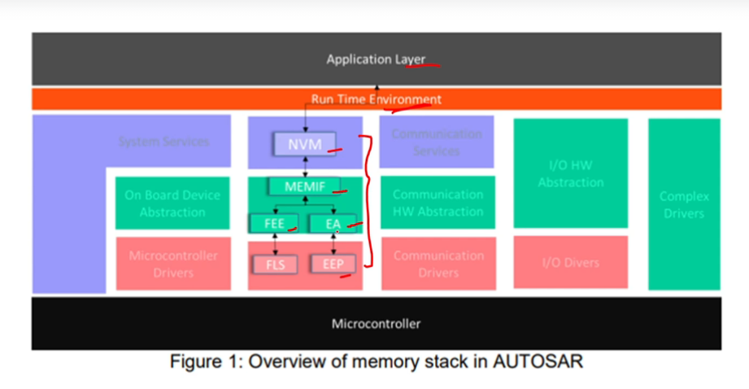

Thì dựa vào sơ đồ ta có thê thấy các lớp như nào, thì ta có câu hỏi là MEMIF làm gì? Thì nó sẽ là lớp trừu tượng của cả 2 EEPROM và Flash. Ví dụ như SWC gọi xuống là muốn lưu vào bộ nhớ không mất dữ liệu. Thì NvM
sẽ xử lý yêu cầu này và gửi xuống cho MemIf và Memif có nhiệm vụ là phân bổ xuống đúng module ví dụ như bên SWC gọi(Fee_Write() thì phải gọi trên flash). Và điều này giúp NvM sẽ không cần quan tâm cách phân luồng truyền -> tái sử dụng cao hơn.


</details>

<h2><summary>12.3. NvM Interaction with other Modules</summary></h2>
<details>

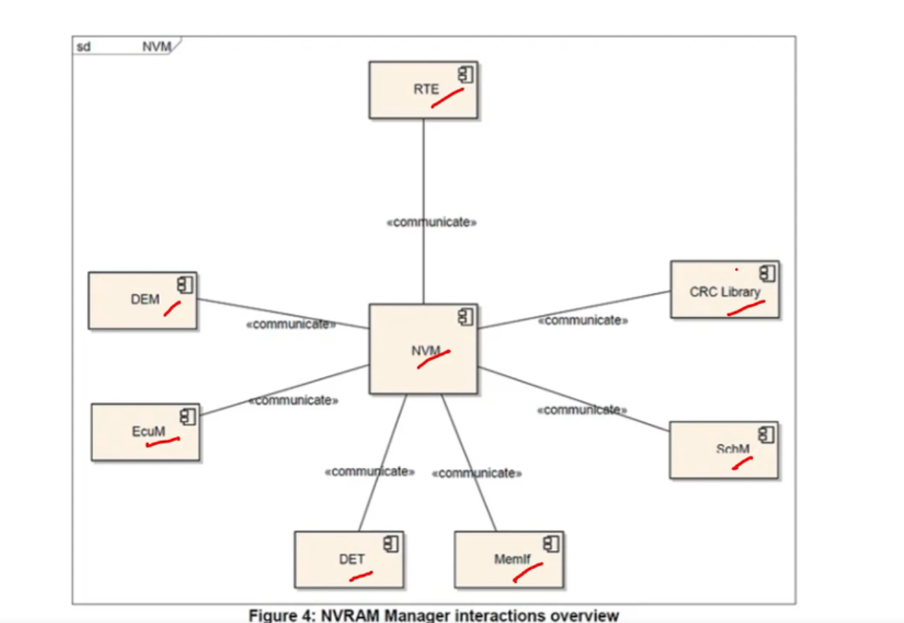

Dựa vào hình này ta có thể thấy các module sẽ làm việc được với NVM

- EcuC: dùng cho việc init, statup and shutdown
- SchM: dùng cho việc lập lịch vận hành của ECU
- MemIf: truy cập vaò memory
- Dem: dùng để log những lỗi tới NvM operations
- Crc: này check để ktra xem truyền data có đungs không.
Ngoài những cái trên thì NvM cũm có thể làm việc với BswM, Det and Csm. Và nó còn làm việc được với all các SWCs, bằng việc sử dụng NvM thông qua RTE.

</details>

<h2><summary>12.4. Flow of Read and Wite Instructions</summary></h2>
<details>

Bài này chỉ xem thoi.

</details>

<h2><summary>12.5. Basic storage objects</summary></h2>
<details>

Phần này sẽ nói về các storage objects cơ bản 
**RAM Block**
- Thì cái vùng RAM block này sẽ có những đặc điểm cơ bản của RAM là nơi lưu trữ data và CRC value(check lỗi). Thì vùng RAM này có chứa cả những dữ liệu thay đổi được và không. Lạ ở đây cái nó bảo RAM block data được gắn chính xác 1 SWC hoặc BSW module, ở đây có thể nó muốn bảo là mỗi cái SWC sẽ có 1 vùng nhớ RAM riêng biệt.

**NV Block**
- NV block là 1 block non volatile, và nó cũm là logical block được tạo trong Fee/Ea(Flash/EEPROM).
- Thì NV block header sẽ nằm đầu tiên trong NV block nếu mà cơ chế Static Block ID enabled (tức là cái header này là optional có cũm được mà không có cũm được)
- NV block CRC (optinal) nó sẽ được config dựa trên việc người dùng yêu cầu hay không, và nó dùng để ktra lỗi của block.
- Cuối cung thì nội dung của NV Block thì nó sẽ lưu dữ iệu từ người dùng thoi, nhưng í là nó sẽ lưu dữ liệu trực tiếp kiểu lưu trong quá trình run luôn áa. Tức là người dùng ở SWC chỉ cần gọi thông qua API NvM như NvM_WriteBlock là oke hết.
 
**ROM Block**
- Thì cái ROM này cũm như Flash thoi, lưu dữ liệu. Và khác cái là nó sẽ không thể được thay đổi trong quá trình run-time. Nó được sử dụng để lưu data mặc định trong trường hợp NV Block bị lỗi.

</details>

<h2><summary>12.6. Admintration Block</summary></h2>
<details>
Theo như chatgpt thì cái này nó là để lưu trư thông tin quản lý của NV Block thoi, chẳng hạn như quản lí trạng thái hợp lệ của dữ liệu, CRC checksum để kiểm trra lỗi, phiên bản hoặc counter, marker flag khi mà ghi chưa xong.
Nói chung là kể cả đọc xong cái ở trong udemy thì t vẫn thấy nó quản lý bộ nhớ thoi và đọc thì nó bao gồm cả RAM cũm có admintration nữa thì phải.

</details>
<h2><summary>12.7.Block Management Types</summary></h2>
<details>

Khả năng từ bài này sẽ xem tổng quan thoi nên sẽ không có các phần bên dưới

</details>


</details>


<h1><summary>CAN</summary></h1>
<details>

Thì cái phần time quanta ảo quá nên t phải ghi lại
Thì nói qua là các node sẽ đồng bộ về mặt time với nhau, nhưng mà CAN bus là đường dây vật lý nên nhiều lúc sẽ có sai số.
Thì 1 cái bit sẽ có 4 segment:
- sync segment: dùng để bảo à đến lúc bit này bắt đầu này (theo đúng thời gian định sẵn) nhưng trên thực tế đường CAN Bus lúc đó có thể bị lệch.
- propagation segment: cơ bản cái này nó giúp kéo dài thời gian, để cho các Node ở xa nhau về mặt vật lý có đủ thời gian nhận ra nhau. (Ví dụ dây CAN dài 20m ECU A phát tín hiệu cho ECU B, dù trong dây điện đi với tốc độ ánh sáng nhưng vẫn có độ trễ trong việc gửi tín hiệu -> Node B có thể đọc sớm quá -> tạo ra propagation để kéo dài thời gian đọc).
- phase segment 1: dùng để bù thời gian theo đơn vị time quanta mà số lượng bù được bao nhiêu dựa vào SJW(1-4QT tức là nếu nó được set là 1 QT thì bù vào tối đa chỉ có 1QT thoi)
- phase segment 2: dùng để bớt thời gian tính theo đơn vị QT (trường hợp này xảy ra nếu sync segment đến muộn hơn dự kiến thì phải rút ngắn lại)

Oke giờ ví dụ nhóo thì giả sử 2 Node A(gửi), B(nhận) mình thiết lập nó như nhau. Giờ Node A nó gửi nhanh đúng không, tức là cái CAN bus nó xuống mức 0 sớm hơn dự kiến, thì bên B nó mới thấy là à, mức tín hiệu đang bị sớm và từ đó nó sẽ dựa vào cái thời gian mà cả 2 thống nhất và thời gian thực tế truyền nhận mà cái Node B hay node nhận chính là người điều chỉnh Phase Segment 1,2.

</details>

